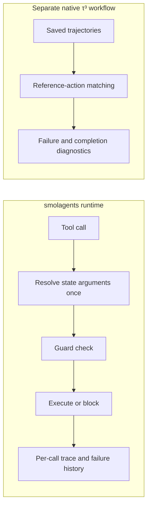

# ReliableToolAgent

**English** | [简体中文](README.zh-CN.md)

**Runtime safeguards and failure analysis for tool-using LLM agents.**

I extended the `smolagents` tool-execution runtime and built trajectory diagnostics for the τ³ retail benchmark, then used controlled experiments to investigate repeated failures and incomplete tasks.

[](https://github.com/Kk111777/ReliableToolAgent/actions/workflows/reliability-study.yml)
[](https://github.com/Kk111777/ReliableToolAgent/actions/workflows/tests.yml)

## My contributions

- **Agent runtime:** per-call traces, structured errors, and a state-aware duplicate-failure Guard. The Guard checks the resolved execution target and records attempted, executed, and blocked calls separately. [Runtime](src/smolagents/agents.py) · [Tests](local_demo/test_duplicate_guard.py)
- **Trajectory analysis:** READ/WRITE classification, repeat and termination diagnostics, and reference-action matching that counts each occurrence and tracks partial completion. [Analyzer](benchmark/tau3/scripts/measurement_v2.py)
- **Controlled experiments:** structured-error × retry-framing ablations, Guard mechanism tests, and a fixed-Agent Simulator comparison. These distinguish a runtime mechanism from benchmark outcomes. [Experiment records](reports/final_technical_report.md)

Project changes are concentrated in `src/smolagents/{agents,memory,utils}.py`, `local_demo/`, `benchmark/tau3/`, and project-specific `scripts/`. Framework examples and `docs/source/` are inherited upstream material.

<a id="key-findings"></a>

## Selected results

| Contribution | Evidence | Finding |
|---|---|---|
| Duplicate-failure Guard | Repeated executed failures **6 → 0** in a three-task toy smoke | Blocks known non-retryable failures; state-alias regressions separately verify that changed targets remain callable. |
| Partial-completion analysis | **13 additional cases** among 197 valid retail trajectories | Reference-action matching detects unfinished tasks after earlier WRITE actions succeeded. |
| Simulator comparison | Fixed Agent: **48/94** versus **93/103** valid successes under U0/U2 | Changing the User Simulator substantially changes measured outcomes. |

<a id="system--experiment-architecture"></a>
<a id="architecture"></a>

## Architecture



## Engineering case: one alias, two execution targets

The call `{"order_id":"lookup"}` first resolves to a missing order and fails. Later, `state["lookup"]` points to a valid order. A failure key built from the raw arguments would incorrectly block the second call.

The implementation resolves arguments once and shares that target across the Guard, execution, and failure history. A changed target can execute; an unchanged known failure can be blocked. [Design and interface limits](docs/engineering_v2.md#guard-match-the-execution-target)

## Benchmark finding: the Simulator matters

The retail study held the Agent fixed across **35 test tasks × 3 trials × U0/U2**. On 25 tasks with all three valid pairs, mean reward difference U2−U0 was **+0.36**, with a 95% task-bootstrap interval **[0.24, 0.48]**. Missing outcomes differed by condition. Pair coverage was 93/105 (88.57%), below the preset 90% gate, so the train expansion was not started. This is Simulator sensitivity, not an Agent improvement. [Full study](reports/frozen_study/retail-holdout-v1/README.md)

## Quick start

Requires `uv`, Python 3.12, and `make`. This creates a project-specific environment and runs offline checks without model credentials.

```bash
git clone https://github.com/Kk111777/ReliableToolAgent.git
cd ReliableToolAgent
bash setup-local.sh
make verify-project
```

## Deep dive

- [Engineering design](docs/engineering_v2.md): runtime interfaces, response adapters, and completion analysis.
- [Experiments and findings](reports/frozen_study/retail-holdout-v1/README.md): fixed-Agent comparison and result boundaries.
- [Technical appendix](docs/technical_appendix.md): reproduction, source evidence, historical experiments, review, and operations.

## Scope

- The Guard has toy mechanism evidence; it was not deployed in native τ³.
- Reference matching is a diagnostic and does not replace official task scoring.
- Response recovery is covered by fault contracts and retained-response replay; its four new integration attempts did not trigger recovery.

Based on Hugging Face `smolagents` commit `30bb1161095dbae2271e6bc3cc4c219cc3897a57`; upstream attribution and the [Apache 2.0 license](LICENSE) are retained.
