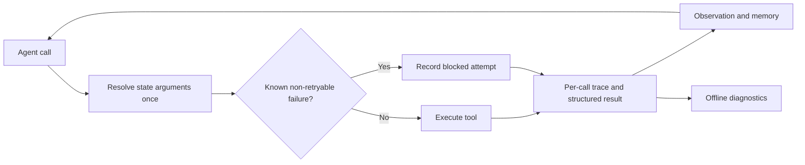

# ReliableToolAgent

**English** | [简体中文](README.zh-CN.md)

**Runtime safeguards, bounded response recovery, and reproducible evaluation for tool-using LLM agents.**

An Agent can produce valid tool calls and still leave a task unfinished. This project makes those failures inspectable: it records each attempted call, checks repeated failures against the actual execution target, and separates Agent behavior from Simulator and evaluator errors.

The runtime extends Hugging Face `smolagents`. A separate study uses the official τ³ retail Agent and orchestrator; the runtime Guard is evaluated in controlled toy experiments.

[](https://github.com/Kk111777/ReliableToolAgent/actions/workflows/reliability-study.yml)
[](https://github.com/Kk111777/ReliableToolAgent/actions/workflows/tests.yml)
[](https://www.python.org/)

[Engineering design](docs/engineering_v2.md) · [Study results](reports/frozen_study/retail-holdout-v1/README.md) · [Reproduction](docs/reproduction.md) · [Evidence index](reports/artifact_index.md)

## What the project adds

| Component | Problem addressed | Implementation |
|---|---|---|
| Tool-call telemetry | A failed step can hide several successful, failed, or blocked calls. | Per-call records with raw and resolved arguments, typed errors, and separate attempted / executed / blocked counts. |
| State-aware failure Guard | The same alias can point to a new order and inherit an unrelated failure. | Resolve arguments once; use the same target for the Guard, execution, and failure history. |
| Bounded response recovery | Empty User responses and fenced evaluator JSON can interrupt a run. | One empty-response retry, strict whole-response JSON normalization, and at most two format retries, with request accounting. |
| Reference-action diagnostics | A terminal metric can miss the last WRITE after earlier actions succeed. | Match successful responses to reference occurrences one-to-one; retain partial completion and unknown values. |
| Reproducible study records | Retries, invalid attempts, or missing pairs can change the reported denominator. | Frozen task selection, first-attempt ledgers, source hashes, task-level bootstrap, and offline compact-data checks. |

WRITE denotes a tool action that changes business state, such as cancelling an order or submitting a return.

## Quick start

Requires `uv`, Python 3.12, and `make`. The setup script creates a project-specific `.venv`; the checks need no model credentials.

```bash
git clone https://github.com/Kk111777/ReliableToolAgent.git
cd ReliableToolAgent
bash setup-local.sh
make verify-project
```

`verify-project` runs the project tests, checks document links, and audits the published study, cases, engineering integration, measurement revision, and model-review counts. It uses `.venv/bin/python` and makes no model calls. Individual commands and fresh-clone limits are in the [reproduction guide](docs/reproduction.md).

<a id="system--experiment-architecture"></a>
<a id="architecture"></a>

## How it works



For example, `{"order_id":"lookup"}` first resolves to a missing order and fails. If `state["lookup"]` later points to a valid order, the new call is allowed. An unchanged failed target can still be blocked. [Source](src/smolagents/agents.py) · [Regression tests](local_demo/test_duplicate_guard.py).

The response adapters and reference-action analyzer run in the separate τ³ workflow. The new native integration check does not deploy the `smolagents` Guard. [Interfaces and limits](docs/engineering_v2.md).

<a id="key-findings"></a>

## Evidence and results

| Check | Recorded result | Interpretation |
|---|---|---|
| [Frozen retail study](reports/frozen_study/retail-holdout-v1/README.md) | 35 test tasks × 3 trials × U0/U2; **210 first attempts**, 197 valid scores; **93/105 valid pairs (88.57%)** | The fixed schedule finished, but pair coverage was below the prespecified 90% gate. The separate 20-task train plan was not started. |
| [Evaluator response replay](reports/engineering-v2/evaluator_replay.json) | **6/6** retained fenced responses pass strict validation with unchanged payloads. | Supports the format-handling repair; old attempts were not rescored. |
| [New native integration](reports/engineering-v2/README.md) | **4/4 valid attempts**, 67 HTTP requests. | Checks connection, execution, and accounting. No recovery branch triggered, so this does not measure a fault-rate reduction. |
| [Measurement v2](reports/engineering-v2/measurement.json) | On 197 valid traces, terminal missing-WRITE candidates change **48 → 61**; all 13 additions are partial completion. | Corrects diagnostic coverage; it does not increase Agent success. |
| [Separate-session model review](reports/model-review-v1/README.md) | 20 selected excerpts; **117/120** initial labels agree. Three missing-reference counts differ as `0` versus `null`. | Exposed an ambiguity in the reviewer instructions. First judgments are retained; the existing protocol keeps `null`. This is agreement, not accuracy. |

U0 and U2 are two User Simulator configurations under the same Agent. Valid success was **48/94** for U0 and **93/103** for U2. The task-bootstrap reward difference U2−U0 was **0.36 [0.24, 0.48]**, using 25 tasks with all three valid pairs. Missingness differed by condition, so this complete-task diagnostic measures Simulator sensitivity and does not establish an Agent improvement.

The historical controlled experiments also remain available: structured error feedback alone increased duplicate failures **29 → 50** with retry framing enabled, while the three-task toy Guard smoke reduced duplicate executed failures **6 → 0**. Their setup, scoring versions, and historical native audits are in the [technical report](reports/final_technical_report.md).

## A failure worth inspecting

In [case C03](reports/frozen_study/retail-holdout-v1/cases.md), two of three reference WRITE actions succeeded before the final User termination. The old metric only detected termination before *any* reference WRITE succeeded; measurement v2 also flags the remaining action. This is why tool execution, task completion, and measurement coverage are recorded separately.

The [eight case records](reports/frozen_study/retail-holdout-v1/case_index.json) retain source hashes, message positions, and tool counters. They were purposefully selected by the analyzer author. The separate model review adds a second reading of selected excerpts, with automatic project context disclosed; it is not strict independent blind review or human annotation.

## Current scope

The engineering revision, fixed primary study, offline evidence checks, and bilingual reports are complete. The train expansion stopped at the preset pair-coverage gate, and no additional native controller experiment was started.

- The Guard has controlled mechanism and interface evidence; no native τ³ Guard gain was measured.
- Response recovery has fault-contract and retained-response replay evidence; the four new attempts only demonstrate integration.
- Exact reference matching is a diagnostic. Equivalent business outcomes may use different arguments, and unknown tool results do not prove that state stayed unchanged.
- Public files support aggregate and counter recomputation. Full trajectory semantics and official reward re-evaluation require retained local raw data.

## Repository map

```text
src/smolagents/   Runtime traces, structured errors, and the failure Guard
local_demo/      Deterministic fault scenarios and project tests
benchmark/tau3/  Native study runner, response adapters, and offline analyzers
reports/         Compact evidence, results, cases, and model-review records
scripts/         Public evidence and documentation checks
docs/            Engineering interfaces and reproduction instructions
```

This fork is based on Hugging Face `smolagents` commit `30bb1161095dbae2271e6bc3cc4c219cc3897a57`. Framework examples and `docs/source/` are inherited upstream material. Upstream attribution and the [Apache 2.0 license](LICENSE) are preserved.
