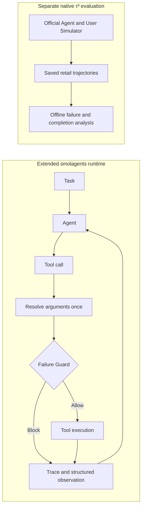

# ReliableToolAgent

**English** | [简体中文](README.zh-CN.md)

**A reliability-focused extension of Hugging Face `smolagents` for studying tool-execution failures and Agent evaluation.**

ReliableToolAgent adds tool-call tracing, structured errors, and a state-aware failure Guard to the Agent runtime. A separate τ³ retail pipeline examines tool failures, repeated calls, partial task completion, and Simulator or evaluator interruptions.

The project started with repeated tool failures in controlled tasks. Moving to native retail evaluation shifted the focus: the inspected runs offered little evidence for adding another failure controller, while changing the User Simulator substantially changed measured outcomes. The work now combines runtime safeguards with trajectory analysis and controlled evaluation.

[](https://github.com/Kk111777/ReliableToolAgent/actions/workflows/reliability-study.yml)
[](https://github.com/Kk111777/ReliableToolAgent/actions/workflows/tests.yml)

## What is different from smolagents?

The comparison uses the [pinned upstream baseline](https://github.com/huggingface/smolagents/tree/30bb1161095dbae2271e6bc3cc4c219cc3897a57) from which this fork was built.

| Upstream baseline | This project adds |
|---|---|
| Tool calls and observations stored in step history | Per-call outcomes with separate attempted / executed / blocked counts |
| Tool-call and execution exceptions | Structured error types, retryability, and failure history |
| State references substituted during tool execution | One resolved argument snapshot shared by Guard matching, execution, and failure records |
| No `duplicate_guard` option | An optional Guard for exact repeats of known non-retryable failures |

Framework examples and `docs/source/` retain their upstream attribution. The runtime extensions and retail evaluation tools are described below.

## Core components

**Reliable tool runtime.** Each call records its original arguments, resolved target, result, and error. The Guard can block a previously failed target while allowing the same state alias to point somewhere new. [Runtime](src/smolagents/agents.py) · [Regression tests](local_demo/test_duplicate_guard.py)

**Trajectory failure analysis.** The offline pipeline classifies READ/WRITE operations, counts repeat and failure events, and matches successful calls to individual reference-action occurrences. Partial completion and unavailable references remain visible in the analysis. [Analyzer](benchmark/tau3/scripts/measurement_v2.py)

**Controlled Agent evaluation.** The harness supports structured-error × retry-framing ablations, toy Guard tests, and fixed-Agent User Simulator comparisons in native τ³. Response adapters and execution controls support these experiments. [Experiments](docs/experiments.md)

<a id="key-findings"></a>

## Results

| Finding | Result |
|---|---|
| Exact duplicate-failure Guard | Repeated executed failures **6 → 0** in a three-task controlled toy smoke |
| Partial-completion analysis | **13 additional partially completed trajectories** detected among 197 valid retail runs |
| Fixed-Agent Simulator study | Mean reward difference U2−U0 **+0.36**, 95% task-bootstrap interval **[0.24, 0.48]** |

The Simulator estimate uses 25 tasks with all three valid trial pairs. Missing outcomes differed by condition and pair coverage limited further expansion. It measures evaluation sensitivity under a fixed Agent. [Study and limits](reports/frozen_study/retail-holdout-v1/README.md)

<a id="system--experiment-architecture"></a>
<a id="architecture"></a>

## Architecture



## One engineering example

Two calls can have identical raw arguments and different execution targets:

```text
{"order_id": "lookup"}
First:  state["lookup"] → missing order → non-retryable failure
Later:  state["lookup"] → valid order   → allowed to execute
```

Matching only the raw arguments would block the second call. Resolving once keeps the Guard, actual execution, and failure history aligned. [Interface design](docs/engineering_v2.md#guard-match-the-execution-target)

## Quick start

Requires `uv`, Python 3.12, and `make`. Setup creates the repository's own `.venv`; the checks run offline without model credentials.

```bash
git clone https://github.com/Kk111777/ReliableToolAgent.git
cd ReliableToolAgent
bash setup-local.sh
make verify-project
```

See the [reproduction guide](docs/reproduction.md) for native benchmark runs and evidence checks.

## Project structure

Project-specific work is concentrated in these files and directories:

```text
src/smolagents/{agents,memory,utils}.py  Runtime extensions
local_demo/                            Controlled tasks and regression tests
benchmark/tau3/                        Native experiments and trajectory analysis
scripts/                               Public evidence and documentation checks
```

## Further reading

- [Engineering design](docs/engineering_v2.md): runtime contracts, Guard behavior, and reference matching.
- [Experiments and findings](docs/experiments.md): toy ablations, native retail evaluation, and Simulator sensitivity.
- [Reproduction and evidence](docs/reproduction.md): setup and commands; [technical appendix](docs/technical_appendix.md) for full records, review, and operations.

## Scope

The Guard is validated in controlled toy tasks; native τ³ uses its official Agent. Reference matching diagnoses task completion alongside official scoring. The fixed retail schedule and engineering revision are complete, with train expansion left unstarted at the preset coverage gate.

Based on Hugging Face `smolagents` under the [Apache 2.0 license](LICENSE).
