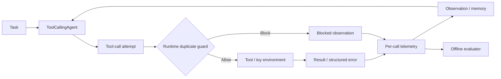
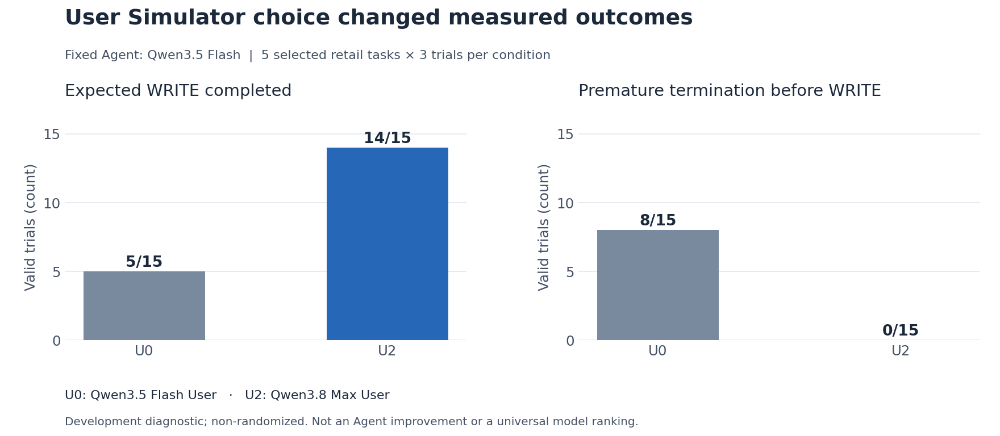

# ReliableToolAgent

**English** | [简体中文](README.zh-CN.md)

**Reliability evaluation and failure analysis for tool-using LLM agents.**

A Hugging Face `smolagents` runtime fork, with a separate study using the native τ³ retail benchmark.

[](https://www.python.org/)
[](https://github.com/huggingface/smolagents)
[](benchmark/tau3/README.md)

## Highlights

- Extended the Agent runtime with per-tool-call traces, structured errors, and an exact duplicate-failure guard.
- Built deterministic fault tests and controlled error-feedback × retry-framing ablations.
- Built an offline τ³ analyzer for tool execution, expected WRITE completion, repeated calls, Simulator termination, and reward outcomes.
- Completed a frozen **35-task × 3-trial × 2-Simulator** study, preserving all **210 first attempts**, request costs and eight reviewed cases.
- Published offline result checks and task-level bootstrap. Valid pairs were **93/105**, below the 90% engineering gate; the planned train replication was not started.

The latest engineering revision fixes state-alias false blocks, adds bounded response recovery, and covers partial WRITE omissions while retaining the frozen results. [Design and validation](docs/engineering_v2.md).

<a id="key-findings"></a>

## Key Results

WRITE means a tool action that changes business state, such as an exchange or return.

| Experiment | Result | Takeaway |
|---|---|---|
| [Toy error feedback](reports/final_technical_report.md#4-structured-error--retry-framing-ablation) — 24 runs/condition | Duplicate failures **29 → 50**, raw → structured with retry ON | Error metadata alone did not improve stopping behavior. |
| [Toy Guard smoke](reports/final_technical_report.md#5-runtime-duplicate-guard) — 3 tasks/condition | Duplicate **executed** failures **6 → 0** | The runtime stopped known failing calls from executing again. |
| [Fixed-Agent Simulator study](reports/final_technical_report.md#9-user-simulator-confound) — 15 trials/condition | Expected WRITE success **5/15 → 14/15** | Simulator choice changed measured Agent outcomes. |
| [τ³ retail audit](reports/final_technical_report.md#10-clean-benchmark-results) — 20 attempts | **18/19** valid success; **0** cross-turn exact repeats | Retry loops were not the main failure mode in this subset. |
| [Frozen retail study](reports/frozen_study/retail-holdout-v1/README.md) — 210 first attempts | U0 **48/94** and U2 **93/103** valid success; **93/105** valid pairs | Simulator sensitivity remained visible; pair coverage failed the engineering gate. |

The audit had 19 valid runs and one evaluator-parse failure, T04. Full tables, model settings, and the original/v2 toy scoring difference are in the [technical report](reports/final_technical_report.md).

The frozen study retained 197 valid scores and 13 invalid attempts, with no additional formal attempts. Its task-bootstrap reward difference U2−U0 was **0.36 [0.24, 0.48]**, using 25 tasks with all three valid pairs. Missingness differed by condition; this complete-task diagnostic does not establish Agent improvement. [Results and limits](reports/frozen_study/retail-holdout-v1/README.md) · [中文](reports/frozen_study/retail-holdout-v1/README.zh-CN.md).

## What I Built

### Agent runtime

- Added per-call records for tool names, normalized arguments, results/errors, and execution status, including parallel steps.
- Carried typed tool errors back into Agent observations and memory.
- Added a Guard for identical calls after a recorded non-retryable failure, with separate **attempted / executed / blocked** counts.

Source: [`agents.py`](src/smolagents/agents.py), [`memory.py`](src/smolagents/memory.py), [`utils.py`](src/smolagents/utils.py). The [Guard tests](local_demo/test_duplicate_guard.py) cover blocking, legal retries, and run isolation.

### Evaluation harness

- Built deterministic order/inventory tasks, fault injection, outcome checks, and a fixed-model 2×2 ablation.
- Built a τ³ trajectory analyzer for READ/WRITE calls, exact duplicates, tool errors, termination, DB/NL rewards, latency, and token usage.

Source: [`local_demo/`](local_demo/), [`analyze_retail_observability.py`](benchmark/tau3/scripts/analyze_retail_observability.py), and [`analyze_clean_u2_failure_audit.py`](benchmark/tau3/scripts/analyze_clean_u2_failure_audit.py).

### Failure analysis

Held the Agent fixed while changing the User Simulator to investigate missed WRITE actions. Kept invalid runs separate from scored failures, and traced cases through messages, tools and final business state. The [eight new cases](reports/frozen_study/retail-holdout-v1/cases.md) include action-order errors, native recovery, termination and measurement limits.

<a id="system--experiment-architecture"></a>

## Architecture



The Guard checks **tool name + identical normalized arguments after state resolution + a recorded non-retryable failure**. It leaves the next decision to the Agent. A blocked attempt is logged but does not execute the tool.

This diagram describes the toy runtime. The τ³ study uses the official Agent and orchestrator; the measurement workflow is reused, while the Guard stays in the toy experiments.

## What the Benchmark Revealed

A zero reward can come from Agent decisions, tool execution, Simulator behavior, or evaluator/infrastructure errors. The traces help distinguish these cases before adding a recovery mechanism.

In the historical five-task development study, changing the Simulator changed premature termination **8/15 → 0/15** and expected WRITE completion **5/15 → 14/15**. The subsequent 20-task audit had no cross-turn exact repeats. The new 35-task study found some repeats, including successful READs; these are not evidence of a repeated-failure loop or a native Guard benefit. Controller expansion remains stopped.



## Representative Case

**T05** was the only valid reward-zero run in the historical 20-task development audit. A desk-lamp exchange succeeded, the user changed the request to a water-bottle return, and the Simulator transferred the conversation before the expected return WRITE. There were no tool failures or exact repeats. The trace leaves completion behavior and Simulator termination entangled. [Read the case analysis](reports/residual_case_T05.md).

## Paired Retail Extension

The [35-task test study](reports/frozen_study/retail-holdout-v1/README.md) finished its fixed 210-slot schedule on 2026-10-04. Its 88.57% valid pair coverage fell below the prespecified 90% threshold. The separate [20-task train plan](benchmark/tau3/studies/retail-replication-v1/README.md) therefore remained unstarted: 120 planned slots, no model scores. Planned coverage is not completed evidence.

The runner retains each first attempt and interrupted trajectory, with request usage, unknown-cost reserves and process locks. The public bundle supports aggregate and interval recomputation; eight sanitized cases support counter checks. Full raw trajectories remain local. The [budgeted execution guide](docs/budgeted_execution.md) explains cost accounting without changing the frozen protocol.

The [cohort report guide](docs/study_results.md) explains the offline bilingual reports and how incomplete coverage, infrastructure failures and additional attempts are reported.

## Quick Start

Requires Python 3.12 and `uv`. No model credentials are needed for these checks.

```bash
git clone https://github.com/Kk111777/ReliableToolAgent.git
cd ReliableToolAgent
bash setup-local.sh
.venv/bin/python -m pytest -q local_demo
.venv/bin/python scripts/audit_packaging_evidence.py
.venv/bin/python benchmark/tau3/scripts/study_evidence.py audit \
  --input reports/frozen_study/retail-holdout-v1/public_evidence.json
```

This runs deterministic tests and checks published evidence, including the frozen cohort aggregates and intervals. The [reproduction guide](docs/reproduction.md) also covers case checks and bilingual report regeneration. Model reruns need a separate benchmark checkout and credentials.

## Repository Structure

```text
src/smolagents/   Runtime changes: traces, structured errors, duplicate guard
local_demo/      Controlled reliability experiments and project tests
benchmark/tau3/  Native benchmark launchers, analyzers, and result snapshots
reports/         Methods, full results, case analysis, and evidence index
scripts/         Evidence checks, document checks, and figure generation
```

## Scope

- The Guard was validated in controlled toy experiments; no τ³ Guard improvement was measured.
- Public native results include a historical 20-task development audit and a separate 35-task paired test study below engineering acceptance; neither is a full leaderboard submission.
- The Simulator study measures evaluation sensitivity under a fixed Agent, not a general model ranking.

## Further Reading

- [Technical report](reports/final_technical_report.md): experiment design, complete metrics, scoring notes, and limitations.
- [Evidence index](reports/artifact_index.md): code, public snapshots, and retained local sources.
- [Reproduction guide](docs/reproduction.md): what a fresh clone can check and what needs raw trajectories or provider credentials.

Based on Hugging Face `smolagents` commit `30bb1161095dbae2271e6bc3cc4c219cc3897a57`. Upstream attribution and the [Apache 2.0 license](LICENSE) are preserved.
