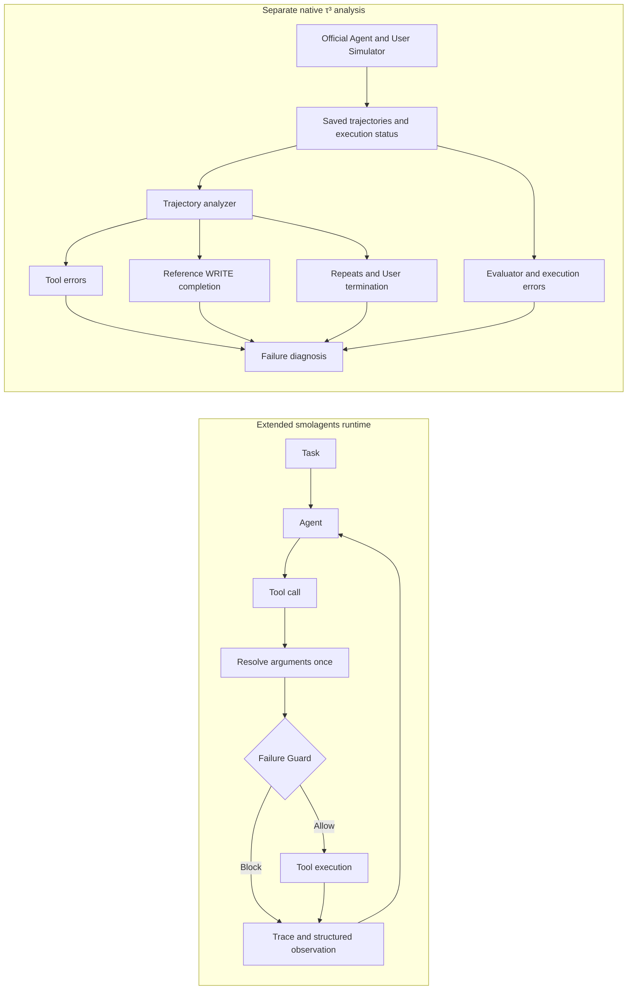

# ReliableToolAgent

**English** | [简体中文](README.zh-CN.md)

**A reliability layer and failure-analysis toolkit for tool-using LLM agents, built on Hugging Face `smolagents`.**

ReliableToolAgent extends tool execution with per-call tracing, structured errors, and state-aware duplicate protection. A separate τ³ retail pipeline examines failed runs through tool execution, WRITE completion, User Simulator behavior, and evaluator errors.

[](https://github.com/Kk111777/ReliableToolAgent/actions/workflows/reliability-study.yml)
[](https://github.com/Kk111777/ReliableToolAgent/actions/workflows/tests.yml)

## What is different from smolagents?

Compared with the [pinned upstream baseline](https://github.com/huggingface/smolagents/tree/30bb1161095dbae2271e6bc3cc4c219cc3897a57), this fork adds runtime safeguards and a native retail analysis pipeline:

| `smolagents` baseline | ReliableToolAgent |
|---|---|
| Tool execution with step-level history | **Per-call tracing**, separating attempted / executed / blocked calls |
| Tool-call and execution exceptions | **Typed errors**, retryability, and failure history |
| State references resolved during execution | **One resolved target** shared by Guard matching, execution, and failure records |
| No `duplicate_guard` option | **State-aware Guard** for exact repeats of known non-retryable failures |
| No τ³ retail analysis pipeline | **Trajectory analysis** for WRITE completion, repeats, termination, and evaluator failures |

Framework examples and `docs/source/` retain their upstream attribution.

## Project at a glance

Two related workflows run independently:

- **Runtime reliability:** extended `smolagents` → tool-call tracing → structured errors → state-aware Guard.
- **Failure analysis:** native τ³ runs → saved trajectories → tool failures, WRITE completion, repeats, and termination. The official Agent loop is retained.

## Core components

**Reliable tool runtime.** Each call records its original arguments, resolved target, result, and error. The Guard blocks exact repeats of known non-retryable failures while allowing the same state alias to point to a new target. [Runtime](src/smolagents/agents.py) · [Regression tests](local_demo/test_duplicate_guard.py)

**Trajectory failure analysis.** The analyzer classifies READ/WRITE operations, counts repeats and failures, and matches successful calls to individual reference-action occurrences. It records partial completion and keeps missing reference information unknown. [Analyzer](benchmark/tau3/scripts/measurement_v2.py)

**Benchmark diagnosis.** Native retail comparisons keep the Agent, tools, and scoring fixed while changing the User Simulator. Separate toy ablations isolate error feedback and retry framing. These controls help investigate changes in measured outcomes. [Experiment design](docs/experiments.md)

<a id="one-engineering-example"></a>

## Engineering example: the same arguments, a different target

Two calls can share raw arguments yet point to different orders:

```text
{"order_id": "lookup"}
First:  state["lookup"] → missing order → non-retryable failure
Later:  state["lookup"] → valid order   → allowed to execute
```

Deduplicating raw arguments would wrongly block the second call. The runtime resolves the arguments once and shares that target between the Guard, execution, and failure history. [Interface design](docs/engineering_v2.md#guard-match-the-execution-target)

<a id="system--experiment-architecture"></a>
<a id="architecture"></a>

## Architecture



<a id="key-findings"></a>
<a id="results"></a>

## Selected findings

| Question | Finding |
|---|---|
| Can measured outcomes change without changing the Agent? | Under different User Simulator conditions, U2−U0 mean reward was **+0.36**, with a 95% task-bootstrap interval **[0.24, 0.48]**. |
| Can terminal-only metrics miss partial work? | Reference-action matching identified **13 additional partially completed trajectories** among 197 valid retail runs. |
| Can the Guard prevent known useless executions? | Exact repeated non-retryable executions fell **6 → 0** in a three-task controlled toy smoke. |

The Simulator estimate uses 25 tasks with all three valid trial pairs. Missing outcomes differed by condition, so the interval describes those complete tasks; pair coverage limited expansion. [Study and limits](reports/frozen_study/retail-holdout-v1/README.md)

## What the experiments changed

The project began with repeated tool failures in controlled tasks, where the Guard prevented the known useless executions. The inspected native retail runs gave little support for extending that controller. Changing the User Simulator while keeping the Agent fixed produced a clear shift in measured outcomes. The remaining work focused on failure diagnosis and partial-completion analysis. [Experiments and findings](docs/experiments.md)

## Quick start

Requires `uv`, Python 3.12, and `make`. Setup creates the repository's own `.venv`; the checks run offline without model credentials.

```bash
git clone https://github.com/Kk111777/ReliableToolAgent.git
cd ReliableToolAgent
bash setup-local.sh
make verify-project
```

See the [reproduction guide](docs/reproduction.md) for native benchmark runs and additional checks.

## Project structure

```text
src/smolagents/{agents,memory,utils}.py  Runtime reliability extensions
local_demo/                            Controlled failures and Guard tests
benchmark/tau3/                        Native τ³ experiments and trajectory analysis
docs/                                  Design, experiments, and reproduction
```

## Further reading

- [Engineering design](docs/engineering_v2.md): runtime contracts, Guard behavior, and reference matching.
- [Experiments and findings](docs/experiments.md): controlled failures, Simulator comparisons, and study limits.
- [Reproduction](docs/reproduction.md): environment setup and commands.

## Scope

The Guard is tested in controlled runtime experiments. Native τ³ runs retain the official Agent loop and are used for trajectory analysis and Simulator comparisons.

Based on Hugging Face `smolagents` under the [Apache 2.0 license](LICENSE).
