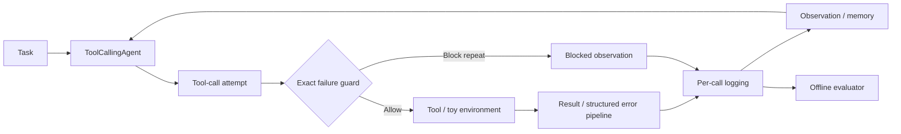
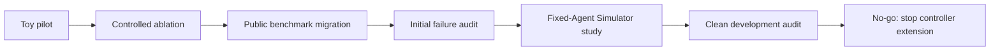

# ReliableToolAgent

**English** | [简体中文](README.zh-CN.md)

**A reproducible harness for tool-agent reliability, runtime safeguards, and trajectory-level failure analysis across controlled tests and public τ³ retail auditing.**

[](https://www.python.org/)
[](https://github.com/huggingface/smolagents)
[](benchmark/tau3/README.md)

## Overview

When a tool-using Agent fails, a zero reward does not identify which component failed.
This project instruments a `smolagents` runtime, tests error feedback and an exact duplicate-failure safeguard in a deterministic toy environment, then audits a pinned public benchmark through its native interface.
The result is an evaluation and attribution workflow, including negative results and a documented decision to stop extending the controller.
Start with the findings below; the [technical report](reports/final_technical_report.md) contains the experimental detail.

## What I Built

- **Runtime instrumentation:** per-call result/error logging, parallel-call observability, canonical arguments, and a structured error pipeline in [`agents.py`](src/smolagents/agents.py), [`memory.py`](src/smolagents/memory.py), and [`utils.py`](src/smolagents/utils.py).
- **A narrow safeguard:** block exact repeat attempts after a recorded non-retryable failure, with separate blocked/executed counts, run-isolated state, and [regression tests](local_demo/test_duplicate_guard.py).
- **Controlled experiments:** deterministic faults and outcome checks; fixed-model raw/structured error × retry-framing ablations; a separate Guard smoke study.
- **Public evaluation and evidence:** native τ³ launchers, an offline READ/WRITE trajectory analyzer, Simulator diagnostics, case attribution, pinned configuration, and [auditable snapshots](reports/artifact_index.md).

## Key Findings

| Study | Observed result | What it supports |
|---|---|---|
| **Toy error ablation** — 8 tasks × 3 repeats per condition | With retry framing ON, raw → structured feedback changed timely stop **4/24 → 1/24** and duplicate failures **29 → 50**. | Metadata alone did not reliably improve behavior; the sampled retry/feedback interaction was adverse. |
| **Toy Guard smoke** — 3 tasks × 1 repeat per condition | Duplicate **executed** failures **6 → 0**; **3 blocked attempts**; task success **3/3** in each condition. | The runtime safeguard worked on this small fixture. |
| **τ³ Simulator diagnostic** — 5 tasks × 3 trials per condition | With the Agent fixed, expected-WRITE success **5/15 → 14/15**; premature termination **8/15 → 0/15**. | Simulator choice materially changed measured Agent outcomes and failure attribution. |
| **Clean τ³ development audit** — 20 attempts | **18/19 valid tasks** passed final and DB reward; **0 cross-turn exact repeats**. One attempt was infrastructure-invalid. | Recovery loops were not the dominant failure mode in this audited subset. |

**Decision:** retain the tested safeguard and negative results, but stop further controller development and τ³ Guard migration. These observations support a scoped evaluation finding, not an Agent algorithm improvement on τ³.

## System / Experiment Architecture

### Controlled Agent runtime



The Guard matches **tool name + normalized identical arguments** against a previously recorded **non-retryable** failure. It does not rewrite identifiers, pick another tool, call `final_answer`, or block retryable temporary failures. A blocked attempt still consumes an Agent decision and is logged; it is not another executed tool failure. This is a history-based safeguard, not a universal idempotency mechanism.

### Research workflow



The public study uses the **official τ³ Agent interface and orchestrator**. It does not insert the `smolagents` loop into τ³. The reusable contribution is the measurement workflow; the toy runtime safeguard and public audit are separate evidence paths.

## Why This Matters

An Agent benchmark is a coupled system: **Agent policy, runtime, tool environment, User Simulator, evaluator, and infrastructure** can all affect the outcome. A valid task that misses its expected WRITE, a Simulator that terminates before another Agent turn, and an evaluator parse error require different explanations.

The initial hypothesis was that unnecessary retry and repeated failures justified more controller logic. Controlled tests exposed that behavior, but external validation changed the diagnosis: many initial WRITE failures were entangled with Simulator termination. After freezing a cleaner development setup, the remaining audit contained no cross-turn exact repeats and one ambiguous reward-zero case. Continuing to optimize a controller for that single case would outrun the evidence.

This is the project's research contribution: **hypothesis → controlled test → external validation → confound discovery → rejection of further controller work at the measured scope**. The implementation contribution is the observability and reproducibility needed to reach that decision.

## Experiments

### 1. Toy error feedback and retry framing

The Agent model stayed at `qwen3.5-flash-2026-02-23`, with temperature `0`, max output tokens `512`, client timeout `60s`, and client retries `0`. Each condition contains the same P01–P08 tasks and three repeats; no Guard was enabled.

| Condition | Feedback / retry framing | Original task success | Timely stop | Duplicate failed calls | Avg. tool calls |
|---|---|---:|---:|---:|---:|
| E0 | Raw / ON | 24/24 | 4/24 | 29 | 2.3333 |
| E1 | Structured / ON | 24/24 | 1/24 | 50 | 3.2083 |
| E2 | Raw / OFF | 23/24 | 5/24 | 33 | 2.5000 |
| E3 | Structured / OFF | 24/24 | 3/24 | 40 | 2.6667 |

**Scoring-version note:** the existing evaluator-v2 rescore reports E2 **24/24**. P04/r01 already answered “无法找到订单”; v2 accepted that missing-order wording. Its answer and trajectory are unchanged. The table preserves the original recorded scores; both versions and their provenance are explained in the [evidence audit](reports/packaging_audit_20261003.md). Timely-stop and duplicate-call counts are unchanged.

Structured feedback produced no consistent stopping benefit. Its additional average tool-call burden was larger with retry framing ON than OFF. This is a descriptive pattern in a small controlled sample, without a significance or generalization claim.

### 2. Exact duplicate-failure safeguard

The separate P03–P05 smoke holds structured feedback ON and retry framing OFF; one repeat per condition.

| Toy-only metric | Guard OFF | Guard ON |
|---|---:|---:|
| Task success | 3/3 | 3/3 |
| Terminal-violation / unnecessary attempts | 6 / 6 | 3 / 3 |
| Duplicate executed failures | 6 | 0 |
| Blocked attempts | 0 | 3 |
| Executed tool calls | 9 | 3 |

The Guard prevented execution of known failing repeats. It did not eliminate the model's repeat attempts or demonstrate broad cost savings. No corresponding τ³ intervention experiment was performed.

### 3. User Simulator confound

The Agent stayed at `openai/qwen3.5-flash-2026-02-23`. Only the User Simulator model changed in the diagnostic; tasks, runtime, generation settings, and evaluation logic stayed fixed.

| 5 selected tasks × 3 trials | U0: Qwen3.5 Flash | U2: Qwen3.8 Max |
|---|---:|---:|
| Valid trials | 15/15 | 15/15 |
| Premature termination before expected WRITE | 8/15 | 0/15 |
| Successful expected WRITE | 5/15 | 14/15 |
| DB success | 5/15 | 14/15 |

U0: `openai/qwen3.5-flash-2026-02-23`; U2: `openai/qwen3.8-max-2026-09-02`. The final U0 set includes a replacement of one infrastructure-invalid trial with the same task/trial configuration, recorded in the audit. The comparison is diagnostic and non-randomized; it does not establish a universal ranking of Simulator models.


### 4. Clean τ³ retail development audit

Pinned benchmark: [`sierra-research/tau2-bench`](https://github.com/sierra-research/tau2-bench), commit `b7ea9074c1cba482b30687fecdb5c8425fd6f619`. The Agent and U2 Simulator are frozen as above; see the [full configuration](benchmark/tau3/README.md#frozen-clean-audit-configuration).

- **Coverage:** 20 attempted tasks, one trial each; 19 valid and one evaluator-parse failure, T04.
- **Outcomes among valid tasks:** final reward **18/19**, DB **18/19**, NL **19/19**; expected WRITE **16/17**.
- **Tool behavior:** **0** cross-turn exact repeats; one same-message duplicate group containing **2 calls in 1 task**; **3 explicit tool failures across 3 tasks**.
- **Residual:** T05 was the only valid reward-zero task. It had no tool failures or exact repeats.

T04 remains visible in the attempted/valid accounting and is excluded only from Agent-behavior denominators. The small development subset does not establish performance on the full benchmark.

## Example Failure Analysis

**Toy P03 — attempted repeat versus execution.** A non-retryable missing-order observation is followed by an identical call. Without the Guard, the tool executes again; with it, the runtime emits a blocked observation and logs the attempted call. This makes prevention measurable without silently crediting the Agent with better decisions. See the [Guard tests](local_demo/test_duplicate_guard.py) and [smoke evidence](reports/packaging_evidence_20261003.json).

**Public T05 — reward zero without a recovery loop.** A confirmed desk-lamp exchange succeeds, then the user changes the request to a water-bottle return. The final expected return WRITE is absent; the Simulator sends `###TRANSFER###` after the Agent explains the changed order state. DB reward is `0`, NL reward is `1`, and there are no tool failures or exact repeats. The trace leaves Agent completion, request changes, and Simulator termination entangled; no primary cause or new controller is assigned. [Read the reconstruction](reports/residual_case_T05.md).

## Reproduction

### Review the public evidence without credentials

```bash
git clone https://github.com/Kk111777/ReliableToolAgent.git
cd ReliableToolAgent
bash setup-local.sh

# Check published snapshots; no API calls and no experiment-file writes.
.venv/bin/python scripts/audit_packaging_evidence.py

# Check local document links, anchors, and image paths.
.venv/bin/python scripts/check_markdown_links.py
```

The [artifact index](reports/artifact_index.md) maps each claim to code and evidence. The [packaging audit](reports/packaging_audit_20261003.md) records which retained sources were cross-checked. Public snapshots enable review, but a fresh clone does not contain the ignored raw trajectories for independent re-analysis.

### Validate the harness and inspect retained trajectories

```bash
# Deterministic tests; no model API calls.
.venv/bin/python -m pytest -q local_demo

# Requires the retained local artifact directories; reads them without changes.
.venv/bin/python scripts/audit_packaging_evidence.py --local
.venv/bin/python -m local_demo.compare_ablation --task-id P03 --repeat 1
```

Benchmark execution requires a separate pinned τ³ checkout and provider credentials. The [benchmark bundle](benchmark/tau3/README.md) documents paid launchers and offline analyzers separately. This presentation update does not run those launchers. Chart generation from the existing snapshot is documented in [assets/README.md](assets/README.md).

## Repository Structure

```text
src/smolagents/     Fork modifications: telemetry, errors, exact failure guard
local_demo/        Toy tasks, fault harness, evaluators, experiments, project tests
benchmark/tau3/    Native benchmark workflow, offline analyzers, compact results
reports/           Technical report, case study, evidence index, source audit
docs/              Retained upstream framework documentation
scripts/           Read-only evidence and documentation checks; chart generation
assets/            Data-derived presentation figures and provenance
artifacts/         Retained local raw toy evidence (ignored)
tau2-bench-baseline/  Separate pinned benchmark checkout (ignored)
```

Historical pilots, diagnostic scripts, and raw experiments remain in place to preserve references and negative evidence. Use the [artifact index](reports/artifact_index.md) as the navigation map. `examples/` and most of `docs/source/` are retained upstream material; they are not claimed as original project contributions.

## Limitations

- This is a scoped reliability/evaluation project, with no leaderboard, SOTA, or production-readiness claim.
- Toy tasks are synthetic; the Guard is supported mainly by toy tests and a three-task smoke. No evidence shows that it improves τ³.
- The public study is a limited retail development subset. The clean audit has one trial per task and 19 valid simulations.
- The development User Simulator differs from official leaderboard configuration; the five-task diagnostic is not a universal model ranking.
- Reward outcomes and mechanical attribution fields are observational. T05 does not isolate an Agent-only defect.
- Evaluator-v2 changed one toy success label; both scoring versions are preserved. The evaluator parse-retry wrapper changes infrastructure handling, not task reward logic.
- Qwen prices were absent from the local LiteLLM price map. A runner display of `$0.0000` is not a valid cost estimate.
- Raw trajectories are retained locally, not shipped with the public evidence bundle. Full upstream regression limitations are recorded in the [publication checks](reports/github_publication_20261002.md).

## Reports and Evidence

- [Technical report](reports/final_technical_report.md): methods, results, interpretation, and negative evidence.
- [Artifact index](reports/artifact_index.md): where to verify each study.

Based on Hugging Face `smolagents` commit `30bb1161095dbae2271e6bc3cc4c219cc3897a57`. Original attribution and [Apache 2.0 license](LICENSE) are preserved.
