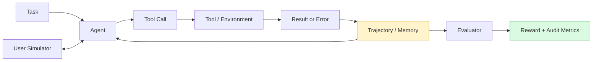

<div align="center">

# ReliableToolAgent

### Evidence-first reliability engineering for tool-calling agents

从可控故障注入到公开 τ³ retail benchmark：记录每一次工具调用，区分 Agent、User Simulator 与基础设施故障，并用证据决定是否值得实现 recovery method。

[](https://www.python.org/)
[](https://github.com/huggingface/smolagents)
[](https://github.com/sierra-research/tau2-bench)
[](reports/final_technical_report.md)
[](LICENSE)

[Technical Report](reports/final_technical_report.md) · [Artifact Index](reports/artifact_index.md) · [T05 Case Study](reports/residual_case_T05.md)

</div>

---

## At a glance

| What was built | Public benchmark evidence | Research outcome |
|---|---|---|
| Deterministic fault harness, per-call telemetry, structured errors, ablations, and an isolated duplicate-failure guard | 20 τ³ retail tasks attempted; 19 valid; 18/19 final reward and DB reward; 19/19 NL reward | Strong observability and failure attribution; insufficient evidence for another Agent intervention |

ReliableToolAgent is a research-engineering fork of HuggingFace `smolagents`. The project asks a practical question:

> When a tool-calling workflow fails, is the cause the Agent, the tool, the environment, the User Simulator, the evaluator, or the runtime?

The project does **not** claim a τ³ leaderboard improvement. Its contribution is a reproducible measurement pipeline and a documented decision to stop adding recovery logic when the public-benchmark evidence did not justify it.

## What I built

- A deterministic T01–T05 harness covering clean multi-step execution, transient failure, wrong-entity repair, legitimate not-found state, and repeated failure.
- Independent per-tool-call telemetry for tool name, canonical arguments, result/error, error type, status, and same-step parallel calls.
- Structured Error Feedback V1 with explicit error semantics, without automatic retry, replanning, or stopping policy.
- A fixed-model raw/structured error × retry-framing 2×2 ablation.
- Duplicate Failure Guard V1 as an isolated toy smoke experiment, including retryable-error and run-isolation checks.
- A τ³ retail observability analyzer for READ/WRITE calls, explicit tool failures, exact duplicates/repeats, reward components, confirmation flow, and infrastructure validity.
- A User Simulator confound study and a clean public-benchmark failure audit.

## System view



The controlled toy harness and τ³ benchmark stay separate. The τ³ study keeps the official Agent, tools, RetailDB environment, orchestrator, and evaluator behavior unchanged.

## Experiment map

| Phase | Purpose | Evidence-based result |
|---|---|---|
| A. Controlled toy pilot | Validate fault injection, memory, evaluator, logging, and intervention isolation | Full experimental path worked; structured errors and retry framing had mixed effects |
| B. τ³ migration | Move from a toy environment to a pinned public retail benchmark | Official execution loop ran with call-level offline observability |
| C. User Simulator study | Test whether terminal behavior was a simulator confound | U0 premature termination 8/15; U2 0/15 under the fixed development setup |
| D. Clean 20×1 audit | Audit residual Agent-side failures without interventions | 19 valid runs, 18 reward successes, one residual reward-zero case |

## Key evidence

### Clean τ³ retail audit

| Metric | Result |
|---|---:|
| Simulations attempted | 20 |
| Valid simulations | 19 |
| Final reward = 1 | 18/19 |
| DB reward = 1 | 18/19 |
| NL reward = 1 | 19/19 |
| Successful expected WRITE | 16/17 |
| Cross-turn exact repeats | 0 |
| Same-message duplicate | 1 task / 2 calls |
| Explicit tool-failure tasks | 3 |
| Valid reward-zero residual cases | 1 — T05 |

T04 was an evaluator JSON parse failure and is excluded from Agent behavior statistics. T05 contains both a mismatched final WRITE and a User Simulator `###TRANSFER###`, so the project records it as a residual candidate rather than assigning a single cause.

Machine-readable snapshot: [reports/tau3-clean-audit-summary.json](reports/tau3-clean-audit-summary.json)

### User Simulator confound

The Agent stayed fixed at `openai/qwen3.5-flash-2026-02-23`.

| 5 tasks × 3 trials | U0: Qwen3.5 Flash | U2: Qwen3.8 Max |
|---|---:|---:|
| Premature user termination | 8/15 | 0/15 |
| Expected WRITE executed | 5/15 | 14/15 |
| DB success | 5/15 | 14/15 |

This is a development diagnostic comparison—not an official τ³ leaderboard comparison or a general model ranking.

### Negative results matter

- Structured error feedback did not consistently improve timely stopping or task success in the toy ablation.
- Retry framing did not produce a stable positive effect.
- The toy Duplicate Failure Guard blocked repeated non-retryable failures in a 3-task smoke run, but it was never evaluated as a τ³ improvement.
- The clean τ³ audit had zero cross-turn exact repeats, so it did not support migrating that Guard.

## Evaluation setup

```yaml
benchmark: sierra-research/tau2-bench
commit: b7ea9074c1cba482b30687fecdb5c8425fd6f619
domain: retail

agent: openai/qwen3.5-flash-2026-02-23
user_simulator: openai/qwen3.8-max-2026-09-02
temperature: 0
max_tokens: 512
request_timeout: 60s
request_retries: 3
simulation_timeout: unset
max_steps: 200
runner_retries: 0
concurrency: 1
seed: 300
```

U2 is the project's frozen **development evaluation configuration**. It is not the official leaderboard default.

## Reproduce locally

### Deterministic project tests

```bash
git clone https://github.com/Kk111777/ReliableToolAgent.git
cd ReliableToolAgent

bash setup-local.sh

.venv/bin/python -m pytest -q local_demo
```

### Re-score frozen toy artifacts

```bash
.venv/bin/python -m local_demo.rescore --source all
```

### Inspect or reproduce the τ³ study

The public [τ³ evidence bundle](benchmark/tau3/README.md) contains the pinned benchmark configuration, launchers, offline analyzers, and compact result snapshots. Re-running the benchmark requires a separate τ³ checkout and provider credentials; reviewing the project does not.

Raw API trajectories and the independent τ³ checkout are intentionally excluded from the public repository. Their provenance and local locations are documented in the [artifact index](reports/artifact_index.md).

## Repository guide

```text
local_demo/          Deterministic harness, pilot tasks, evaluators, ablations
src/smolagents/      Per-call logging, structured errors, Guard instrumentation
tests/               Project and regression tests
benchmark/tau3/      Public τ³ launchers, analyzers, config, compact evidence
reports/             Public evidence, technical report, case study, resume notes
artifacts/           Local raw toy trajectories; ignored when large
```

Recommended reading order:

1. [Final technical report](reports/final_technical_report.md)
2. [T05 residual case](reports/residual_case_T05.md)
3. [Artifact index](reports/artifact_index.md)
4. [τ³ evidence bundle](benchmark/tau3/README.md)
5. [`local_demo/run.py`](local_demo/run.py)
6. [`local_demo/test_tool_call_logging.py`](local_demo/test_tool_call_logging.py)
7. [`local_demo/test_duplicate_guard.py`](local_demo/test_duplicate_guard.py)

## Scope and limitations

- The toy environment is narrow and synthetic.
- The clean τ³ audit used one trial per task and produced 19 valid simulations.
- The development User Simulator is not the official leaderboard default.
- No Guard, Completion Controller, recovery prompt, or Agent intervention was evaluated on τ³.
- Qwen costs were unavailable from the local LiteLLM price map; `$0.0000` runner output is not a real cost estimate.
- Public claims should use the compact reports in `reports/`; local raw artifacts remain the source of truth for detailed trajectory review.

## Upstream and license

This repository is based on HuggingFace `smolagents` commit `30bb1161095dbae2271e6bc3cc4c219cc3897a57`. The public benchmark study used Sierra τ³-bench commit `b7ea9074c1cba482b30687fecdb5c8425fd6f619`.

Licensed under Apache 2.0. See [LICENSE](LICENSE).
