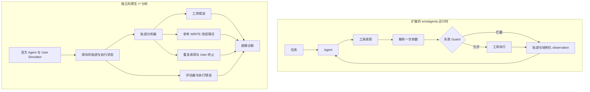

# ReliableToolAgent

[English](README.md) | **简体中文**

**基于 Hugging Face `smolagents`，为使用工具的 LLM Agent 提供运行时可靠性扩展与失败分析工具。**

ReliableToolAgent 为工具执行增加逐调用记录、结构化错误和感知 state 的重复失败防护。另一条独立的 τ³ retail 分析链从工具执行、WRITE 完成情况、User Simulator 行为和评估器错误入手，检查失败的运行。

[](https://github.com/Kk111777/ReliableToolAgent/actions/workflows/reliability-study.yml)
[](https://github.com/Kk111777/ReliableToolAgent/actions/workflows/tests.yml)

## 与 smolagents 有什么不同？

相比本 fork 使用的[固定上游版本](https://github.com/huggingface/smolagents/tree/30bb1161095dbae2271e6bc3cc4c219cc3897a57)，本项目增加了运行时防护与原生 retail 分析链：

| `smolagents` 基线 | ReliableToolAgent |
|---|---|
| 执行工具，在 step 历史中保存记录 | **逐调用追踪**，区分尝试 / 执行 / 拦截 |
| 工具调用与执行异常 | **结构化错误类型**、可重试信息与失败历史 |
| 执行时解析 state 引用 | **共用一次解析后的目标**，让 Guard 检查、执行与失败记录一致 |
| 没有 `duplicate_guard` 选项 | **感知 state 的 Guard**，拦截已知不可重试失败的精确重复调用 |
| 没有 τ³ retail 分析链 | **轨迹分析**，检查 WRITE 完成、重复调用、终止和评估器失败 |

框架示例与 `docs/source/` 保留上游归属。

## 项目概览

两条相关的工作流独立运行：

- **运行时可靠性**：扩展 `smolagents` → 逐调用追踪 → 结构化错误 → 感知 state 的 Guard。
- **失败分析**：原生 τ³ 运行 → 保存轨迹 → 分析工具失败、WRITE 完成、重复调用与终止；保留官方 Agent 循环。

## 核心模块

**可靠工具运行时。** 每次调用记录原始参数、解析后的目标、结果和错误。Guard 拦截已知不可重试失败的精确重复调用，同时允许同一个 state 引用指向新目标。[运行时源码](src/smolagents/agents.py) · [回归测试](local_demo/test_duplicate_guard.py)

**轨迹失败分析。** 分析器区分 READ/WRITE，统计重复与失败事件，并把成功调用匹配到逐个参考动作。它记录部分完成情况，参考信息缺失时保留未知。[分析器](benchmark/tau3/scripts/measurement_v2.py)

**Benchmark 诊断。** 原生 retail 对照固定 Agent、工具与评分，只改变 User Simulator；另外的 toy 消融分别检查错误反馈与重试引导。这些控制变量帮助判断测得的结果为什么变化。[实验设计](docs/experiments.zh-CN.md)

<a id="one-engineering-example"></a>
<a id="一个工程案例"></a>

## 工程案例：参数相同，目标不同

两次调用可以使用相同的原始参数，却指向不同订单：

```text
{"order_id": "lookup"}
第一次：state["lookup"] → 不存在的订单 → 不可重试失败
之后：  state["lookup"] → 有效订单     → 允许执行
```

只对原始参数去重会误拦截第二次调用。运行时只解析一次参数，Guard、实际执行和失败历史共用这个目标。[接口设计](docs/engineering_v2.zh-CN.md#guard按执行目标判断重复)

<a id="system--experiment-architecture"></a>
<a id="architecture"></a>

## 系统结构



<a id="key-findings"></a>
<a id="results"></a>
<a id="结果"></a>

## 代表性发现

| 问题 | 发现 |
|---|---|
| 不改变 Agent，测得的结果会变化吗？ | 改变 User Simulator 条件后，U2−U0 平均 reward 差为 **+0.36**，95% 任务级 bootstrap 区间为 **[0.24, 0.48]**。 |
| 只看终止指标，会漏掉已完成的部分吗？ | 在 197 条有效 retail 运行中，参考动作匹配识别出 **13 条旧指标遗漏的部分完成轨迹**。 |
| Guard 能阻止已知无效的重复执行吗？ | 三个任务的受控 toy smoke 中，重复执行已知不可重试失败的次数 **6 → 0**。 |

Simulator 估计使用三对 trial 均有效的 25 个任务。两组缺失情况不同，因此区间描述的是这些完整任务；配对覆盖限制了扩展。[研究与边界](reports/frozen_study/retail-holdout-v1/README.zh-CN.md)

## 实验如何改变了项目方向

项目从受控任务中的重复工具失败出发，Guard 阻止了这些已知无效的执行。已检查的原生 retail 运行没有提供足够依据来扩展该控制器；固定 Agent、改变 User Simulator 却让测得的结果明显变化。后续工作因此转向故障诊断与部分完成分析。[实验与发现](docs/experiments.zh-CN.md)

## 快速开始

需要 `uv`、Python 3.12 和 `make`。安装脚本创建仓库自己的 `.venv`，检查离线运行，不需要模型凭据。

```bash
git clone https://github.com/Kk111777/ReliableToolAgent.git
cd ReliableToolAgent
bash setup-local.sh
make verify-project
```

原生 benchmark 运行与其他检查见[复现说明](docs/reproduction.zh-CN.md)。

## 项目结构

```text
src/smolagents/{agents,memory,utils}.py  运行时可靠性扩展
local_demo/                            受控故障场景与 Guard 测试
benchmark/tau3/                        原生 τ³ 实验与轨迹分析
docs/                                  设计、实验与复现说明
```

## 深入阅读

- [工程设计](docs/engineering_v2.zh-CN.md)：运行时接口、Guard 行为与参考匹配。
- [实验与发现](docs/experiments.zh-CN.md)：受控故障、Simulator 对照与研究边界。
- [复现说明](docs/reproduction.zh-CN.md)：环境与运行命令。

## 范围

Guard 在受控运行时实验中验证；原生 τ³ 保留官方 Agent 循环，用于轨迹分析与 Simulator 对照。

基于 Hugging Face `smolagents`，保留 [Apache 2.0 许可证](LICENSE)。
