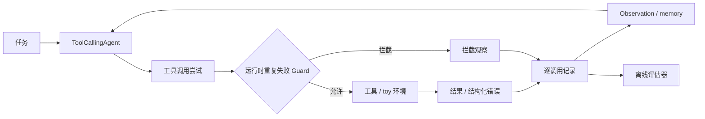

# ReliableToolAgent

[English](README.md) | **简体中文**

**工具调用 LLM Agent 的可靠性评估与失败分析。**

项目包含一个 Hugging Face `smolagents` 运行时 fork，以及一项使用 τ³ 原生运行链的独立 retail 基准研究。

[](https://www.python.org/)
[](https://github.com/huggingface/smolagents)
[](benchmark/tau3/README.md)

## 核心工作（Highlights）

- 改造 Agent 运行时，加入逐工具调用轨迹、结构化错误和精确重复失败 Guard。
- 构建确定性故障测试，完成错误反馈 × 重试提示的受控消融。
- 实现 τ³ 离线分析器，检查工具执行、预期 WRITE 完成、重复调用、Simulator 终止和 reward 结果。
- 审计 20 个 retail 任务：**19 个有效任务中 18 个成功**，**跨轮精确重复为 0**。案例分析没有发现继续扩展重试控制器的依据。

<a id="key-findings"></a>

## 主要结果（Key Results）

WRITE 指改变业务状态的工具操作，例如换货或退货。

| 实验 | 结果 | 结论 |
|---|---|---|
| [Toy 错误反馈](reports/final_technical_report.md#4-structured-error--retry-framing-ablation)——每组 24 次 | retry ON 时，raw → structured 的重复失败为 **29 → 50** | 单靠错误元数据没有改善停止行为。 |
| [Toy Guard smoke](reports/final_technical_report.md#5-runtime-duplicate-guard)——每组 3 个任务 | 重复的**实际执行失败**为 **6 → 0** | 运行时阻止了已有失败历史的相同调用再次执行。 |
| [固定 Agent 的 Simulator 研究](reports/final_technical_report.md#9-user-simulator-confound)——每组 15 个 trial | 预期 WRITE 成功为 **5/15 → 14/15** | Simulator 选择改变了测得的 Agent 结果。 |
| [τ³ retail 审计](reports/final_technical_report.md#10-clean-benchmark-results)——20 次尝试 | 有效任务成功 **18/19**；跨轮精确重复 **0** | 在这个子集中，重试循环不是主要失败模式。 |

审计共 19 次有效运行，另有 T04 因评估器解析失败而无效。完整指标、模型配置及 toy 原始／v2 评分差异见[技术报告](reports/final_technical_report.md)。

## 实现内容（What I Built）

### Agent 运行时

- 为每次调用记录工具名、规范化参数、结果／错误和执行状态，覆盖并行调用步骤。
- 将带有明确类型的工具错误传回 Agent 的 observation 和 memory。
- 对已记录为不可重试失败的相同调用加入 Guard，分别统计**尝试 / 执行 / 拦截**。

源码：[`agents.py`](src/smolagents/agents.py)、[`memory.py`](src/smolagents/memory.py)、[`utils.py`](src/smolagents/utils.py)。[Guard 测试](local_demo/test_duplicate_guard.py)覆盖拦截、合法重试及不同 run 的状态隔离。

### 评估框架

- 构建确定性的订单／库存任务、故障注入和业务结果检查，完成固定模型的 2×2 消融。
- 实现 τ³ 轨迹分析器，统计 READ/WRITE、精确重复、工具错误、终止、DB/NL reward、延迟和 token 使用。

源码：[`local_demo/`](local_demo/)、[`analyze_retail_observability.py`](benchmark/tau3/scripts/analyze_retail_observability.py)及 [`analyze_clean_u2_failure_audit.py`](benchmark/tau3/scripts/analyze_clean_u2_failure_audit.py)。

### 失败分析

固定 Agent，仅替换 User Simulator，调查预期 WRITE 为什么没有完成。将基础设施无效运行与行为失败分开，再沿消息、工具调用和最终业务状态分析唯一有效的 reward-zero 案例。

<a id="system--experiment-architecture"></a>

## 架构（Architecture）



Guard 检查**工具名 + 规范化后完全相同的参数 + 已记录的不可重试失败**，接下来的决策仍由 Agent 做出。被拦截的尝试会留下记录，但不会执行工具。

图中展示的是 toy 运行时。τ³ 研究使用官方 Agent 和 orchestrator；复用的是测量流程，Guard 留在 toy 实验中。

## 基准研究带来的发现（What the Benchmark Revealed）

Reward 为零可能来自 Agent 决策、工具执行、Simulator 行为，也可能来自评估器或基础设施错误。轨迹记录帮助区分这些情况，再判断是否需要恢复机制。

固定 Agent 后，替换 Simulator 使提前终止从 **8/15 降至 0/15**，预期 WRITE 完成从 **5/15 升至 14/15**。后续审计没有跨轮精确重复。这些发现促使项目停止为这一子集继续扩展重试控制器。


## 代表案例（Representative Case）

**T05** 是唯一有效的 reward-zero 运行。台灯换货成功后，用户改为要求水瓶退货，Simulator 在预期 return WRITE 前结束并转接会话。轨迹没有工具失败或精确重复，完成行为与 Simulator 终止仍交织在一起。[查看案例分析](reports/residual_case_T05.md)。

## Retail 配对复核

[35 个 test 任务的冻结主实验](benchmark/tau3/studies/retail-holdout-v1/README.zh-CN.md)与独立的[20 任务分层补充复核](benchmark/tau3/studies/retail-replication-v1/README.zh-CN.md)，合计增加 55 个不同 retail 任务、330 条计划配对轨迹。运行器保存每次尝试与中断轨迹，记录请求用量和估算费用，并支持离线任务级 bootstrap。2026-10-04 因预算调整暂停时，210 个正式首次槽位中已有 108 个记录，train 补充复核尚未启动。[按预算恢复的入口](docs/budgeted_execution.zh-CN.md)检查总请求费用并保留冻结协议。计划槽位与上方历史结果分开报告。

## 快速开始（Quick Start）

需要 Python 3.12 和 `uv`。以下检查不需要模型凭据。

```bash
git clone https://github.com/Kk111777/ReliableToolAgent.git
cd ReliableToolAgent
bash setup-local.sh
.venv/bin/python -m pytest -q local_demo
.venv/bin/python scripts/audit_packaging_evidence.py
```

这些命令运行确定性测试并检查公开证据，不执行模型基准。[复现说明](docs/reproduction.zh-CN.md)介绍本地原始数据核对；[τ³ 文档](benchmark/tau3/README.md)介绍基准环境和分析流程。

## 仓库结构（Repository Structure）

```text
src/smolagents/   运行时改动：调用记录、结构化错误、重复失败 Guard
local_demo/      受控可靠性实验与项目测试
benchmark/tau3/  原生基准运行脚本、分析器、结果快照
reports/         方法、完整结果、案例分析、证据索引
scripts/         证据检查、文档检查、图表生成
```

## 研究范围（Scope）

- Guard 在受控 toy 实验中验证，没有测得其在 τ³ 上的性能收益。
- 公开结果来自 20 个任务的 retail 开发审计，不是完整排行榜提交。
- Simulator 研究衡量固定 Agent 下的评估敏感性，不是模型通用排名。

## 进一步阅读（Further Reading）

- [技术报告](reports/final_technical_report.md)：实验设计、完整指标、评分说明及限制。
- [证据索引](reports/artifact_index.md)：代码、公开快照和本地保留来源。
- [复现说明](docs/reproduction.zh-CN.md)：新克隆的仓库能检查什么，哪些步骤需要原始轨迹或服务商凭据。

基于 Hugging Face `smolagents` commit `30bb1161095dbae2271e6bc3cc4c219cc3897a57`。保留上游归属及 [Apache 2.0 许可证](LICENSE)。
