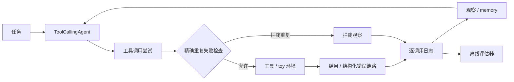
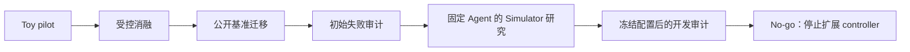

# ReliableToolAgent

[English](README.md) | **简体中文**

**面向工具调用 Agent 的可复现可靠性评估框架：覆盖运行时防护、受控实验，以及公开 τ³ retail 基准中的轨迹分析和失败归因。**

[](https://www.python.org/)
[](https://github.com/huggingface/smolagents)
[](benchmark/tau3/README.md)

## 项目概览（Overview）

工具调用 Agent 的 reward 为零，并不能说明究竟是哪一个组件出了问题。
本项目改造 `smolagents` 运行时，在确定性 toy 环境中测试错误反馈和精确重复失败防护，再通过原生接口审计固定版本的公开基准。
最终产出是一套评估与归因流程，同时保留负结果，以及停止继续扩展 controller 的研究判断。
可以先阅读下方的关键发现；实验细节见[技术报告](reports/final_technical_report.md)。

## 项目实现（What I Built）

- **运行时观测：** 在 [`agents.py`](src/smolagents/agents.py)、[`memory.py`](src/smolagents/memory.py) 和 [`utils.py`](src/smolagents/utils.py) 中实现逐调用结果／错误记录、并行调用观测、参数规范化和结构化错误处理链路。
- **范围明确的防护：** 对已记录为不可重试失败的精确重复调用进行拦截，分别统计 blocked 与 executed 调用，隔离不同 run 的历史状态，并提供[回归测试](local_demo/test_duplicate_guard.py)。
- **受控实验：** 实现确定性故障和业务结果检查；固定模型，进行 raw/structured error × retry framing 消融；单独验证 Guard smoke。
- **公开评估与证据：** 提供 τ³ 原生运行脚本、离线 READ/WRITE 轨迹分析器、Simulator 诊断、案例归因、固定配置和[可核对的结果快照](reports/artifact_index.md)。

## 关键发现（Key Findings）

| 研究 | 观察结果 | 支持的结论 |
|---|---|---|
| **Toy 错误消融**——每组 8 个任务 × 3 次重复 | retry framing ON 时，raw → structured 反馈使及时停止 **4/24 → 1/24**，重复失败 **29 → 50**。 | 错误元数据没有稳定改善行为；样本中的重试提示与反馈交互方向为负。 |
| **Toy Guard smoke**——每组 3 个任务 × 1 次重复 | 重复的**实际执行失败** **6 → 0**；记录 **3 次拦截尝试**；两组任务成功均为 **3/3**。 | 运行时防护在这一小型测试环境中按预期工作。 |
| **τ³ Simulator 诊断**——每组 5 个任务 × 3 个 trial | 固定 Agent 后，expected-WRITE success **5/15 → 14/15**；提前终止 **8/15 → 0/15**。 | Simulator 的选择明显改变了测得的 Agent 结果与失败归因。 |
| **Clean τ³ 开发审计**——20 次尝试 | **18/19 个有效任务**的 final 与 DB reward 通过；**0 次跨轮精确重复**。另有一次基础设施无效记录。 | 在本次审计子集中，恢复循环并非主导失败模式。 |

**研究决策：** 保留已验证的防护和负结果，停止继续设计 controller，也不将 Guard 迁移到 τ³。这些观察支持有范围限制的评估结论，不代表 Agent 算法在 τ³ 上获得了提升。

## 系统与实验架构（System / Experiment Architecture）

### 受控 Agent 运行时



Guard 将**工具名 + 规范化后完全相同的参数**与之前记录的**不可重试失败**匹配。它不改写标识符、不选择其他工具、不调用 `final_answer`，也不阻止可重试的临时故障。被拦截的尝试仍消耗一次 Agent 决策，并被记录；它不是又一次实际执行的工具失败。这是一种基于失败历史的防护，不是通用幂等机制。

### 研究流程



公开基准研究使用 **τ³ 官方 Agent 接口和 orchestrator**，没有将 `smolagents` 循环插入 τ³。复用的是测量流程；toy 运行时防护和公开审计属于两条独立证据路径。

## 研究意义（Why This Matters）

Agent 基准是一个耦合系统：**Agent 策略、运行时、工具环境、User Simulator、评估器和基础设施**都可能影响结果。有效任务缺少预期 WRITE、Simulator 在 Agent 获得下一轮之前终止，以及评估器解析失败，需要分别解释。

最初的假设是：无意义重试和重复失败需要更多 controller 逻辑。受控实验确实暴露了这种行为，但外部验证改变了诊断：初始的许多 WRITE 失败与 Simulator 终止交织。冻结更适合本项目诊断的开发配置后，审计中没有跨轮精确重复，只有一个归因尚不明确的 reward-zero 案例。继续围绕这一案例优化 controller，会超出已有证据。

项目的研究贡献是：**提出假设 → 受控测试 → 外部验证 → 发现混杂因素 → 在已测范围内否决继续扩展 controller**。工程贡献则是支持这一判断的可观测性与可复现流程。

## 实验（Experiments）

### 1. Toy 错误反馈与重试提示

Agent 模型固定为 `qwen3.5-flash-2026-02-23`，temperature 为 `0`，最大输出 tokens 为 `512`，客户端 timeout 为 `60s`，客户端 retries 为 `0`。每组使用相同的 P01–P08 任务，各重复三次；未开启 Guard。

| 条件 | 反馈 / retry framing | 原始任务成功 | 及时停止 | 重复失败调用 | 平均工具调用 |
|---|---|---:|---:|---:|---:|
| E0 | Raw / ON | 24/24 | 4/24 | 29 | 2.3333 |
| E1 | Structured / ON | 24/24 | 1/24 | 50 | 3.2083 |
| E2 | Raw / OFF | 23/24 | 5/24 | 33 | 2.5000 |
| E3 | Structured / OFF | 24/24 | 3/24 | 40 | 2.6667 |

**评分版本说明：** 已有 evaluator-v2 重评分记录的 E2 为 **24/24**。P04/r01 原回答已经写出“无法找到订单”，v2 接受了这一缺失订单措辞。回答和轨迹没有改变。上表保留原始记录的评分；两个版本及来源见[证据审计](reports/packaging_audit_20261003.md)。及时停止和重复调用计数没有改变。

结构化反馈没有稳定改善停止行为。retry framing ON 时，它增加的平均工具调用负担比 OFF 时更大。这是小型受控样本中的描述性模式，不构成显著性或泛化结论。

### 2. 精确重复失败防护

独立的 P03–P05 smoke 固定 structured feedback ON、retry framing OFF；每组重复一次。

| 仅限 toy 的指标 | Guard OFF | Guard ON |
|---|---:|---:|
| 任务成功 | 3/3 | 3/3 |
| 终止状态后的违规 / 多余尝试 | 6 / 6 | 3 / 3 |
| 重复的实际执行失败 | 6 | 0 |
| 被拦截的尝试 | 0 | 3 |
| 实际执行的工具调用 | 9 | 3 |

Guard 阻止了已有失败历史的重复执行。它没有消除模型发起重复调用的尝试，也没有证明普遍成本收益。项目未在 τ³ 上进行对应的干预实验。

### 3. User Simulator 混杂因素

Agent 保持为 `openai/qwen3.5-flash-2026-02-23`。诊断中仅替换 User Simulator 模型，任务、运行时、生成配置和评估逻辑保持固定。

| 5 个选定任务 × 3 个 trial | U0：Qwen3.5 Flash | U2：Qwen3.8 Max |
|---|---:|---:|
| 有效 trial | 15/15 | 15/15 |
| 预期 WRITE 前提前终止 | 8/15 | 0/15 |
| 成功执行预期 WRITE | 5/15 | 14/15 |
| DB success | 5/15 | 14/15 |

U0：`openai/qwen3.5-flash-2026-02-23`；U2：`openai/qwen3.8-max-2026-09-02`。最终 U0 集合包含一次对基础设施无效 trial 的替换，使用相同 task/trial 配置，已在审计中披露。该比较是非随机的诊断研究，不能据此给出 Simulator 模型的通用排名。


### 4. Clean τ³ retail 开发审计

固定基准为 [`sierra-research/tau2-bench`](https://github.com/sierra-research/tau2-bench)，commit 为 `b7ea9074c1cba482b30687fecdb5c8425fd6f619`。Agent 与 U2 Simulator 按上述配置冻结；[完整配置](benchmark/tau3/README.md#frozen-clean-audit-configuration)见基准文档。

- **覆盖范围：** 尝试 20 个任务，每个任务一个 trial；19 个有效，T04 因 evaluator parse failure 无效。
- **有效任务结果：** final reward **18/19**、DB **18/19**、NL **19/19**；expected WRITE **16/17**。
- **工具行为：** **0 次**跨轮精确重复；一组同消息重复，包含 **1 个任务中的 2 次调用**；**3 个任务中共 3 次显式工具失败**。
- **残余案例：** T05 是唯一有效的 reward-zero 任务，没有工具失败或精确重复。

T04 仍保留在 attempted/valid 计数中，仅从 Agent 行为指标的分母中排除。这一小型开发子集不能证明完整基准上的性能。

## 失败分析示例（Example Failure Analysis）

**Toy P03——重复尝试与实际执行的区别。** 不可重试的缺失订单观察之后，出现完全相同的调用。不开启 Guard 时，工具再次执行；开启后，运行时生成 blocked observation，并记录调用尝试。这样可以测量拦截效果，而不会把 runtime 的拦截误记为 Agent 决策变好。见 [Guard 测试](local_demo/test_duplicate_guard.py)和 [smoke 证据](reports/packaging_evidence_20261003.json)。

**公开 T05——没有恢复循环的 reward-zero。** 已确认的台灯换货成功，随后用户将请求改为水瓶退货。最终预期的 return WRITE 未发生；Agent 解释订单状态变化后，Simulator 发出 `###TRANSFER###`。DB reward 为 `0`、NL reward 为 `1`，没有工具失败或精确重复。轨迹中的 Agent 完成行为、用户请求变化和 Simulator 终止相互交织，项目未指定一个已确定的主因，也未据此添加 controller。[完整重建](reports/residual_case_T05.md)。

## 复现（Reproduction）

### 无需凭据检查公开证据

```bash
git clone https://github.com/Kk111777/ReliableToolAgent.git
cd ReliableToolAgent
bash setup-local.sh

# 检查公开快照；不调用 API，也不写入实验文件。
.venv/bin/python scripts/audit_packaging_evidence.py

# 检查本地文档链接、锚点与图片路径。
.venv/bin/python scripts/check_markdown_links.py
```

[Artifact 索引](reports/artifact_index.md)将每项结论对应到代码和证据；[包装审计](reports/packaging_audit_20261003.md)记录了核对过的保留来源。公开快照支持审阅，但 fresh clone 不包含被忽略的原始轨迹，无法据此独立重做全部分析。

### 验证框架并检查已保留的轨迹

```bash
# 确定性测试；不调用模型 API。
.venv/bin/python -m pytest -q local_demo

# 需要本地保留的 artifact 目录；只读，不修改文件。
.venv/bin/python scripts/audit_packaging_evidence.py --local
.venv/bin/python -m local_demo.compare_ablation --task-id P03 --repeat 1
```

运行基准需要独立的固定版本 τ³ checkout 和 provider 凭据。[基准证据包](benchmark/tau3/README.md)分别说明付费运行脚本与离线分析器。本次文档更新不运行这些启动脚本；从已有快照生成图表的说明见 [assets/README.md](assets/README.md)。

## 仓库结构（Repository Structure）

```text
src/smolagents/     Fork 修改：观测、错误语义、精确重复失败 Guard
local_demo/        Toy 任务、故障框架、评估器、实验、项目测试
benchmark/tau3/    原生基准流程、离线分析器、精简结果
reports/           技术报告、案例分析、证据索引、来源审计
docs/              保留的上游框架文档
scripts/           只读证据检查、文档检查、图表生成
assets/            从数据生成的展示图与 provenance
artifacts/         本地保留的原始 toy 证据（Git 忽略）
tau2-bench-baseline/  独立的固定版本基准 checkout（Git 忽略）
```

历史 pilot、诊断脚本和原始实验保持原位，保留引用和负结果；[Artifact 索引](reports/artifact_index.md)提供导航。`examples/` 和大部分 `docs/source/` 是保留的上游内容，不作为本项目原创贡献。

## 限制（Limitations）

- 本项目是有范围限制的可靠性与评估研究，不宣称排行榜成绩、SOTA 或生产就绪。
- Toy 任务为合成任务；Guard 的证据主要来自 toy 测试和三任务 smoke。没有证据证明它改善了 τ³。
- 公开研究仅覆盖 retail 开发子集；clean audit 每个任务一个 trial，共 19 个有效 simulation。
- 开发用 User Simulator 与官方排行榜配置不同；五任务诊断不是通用模型排名。
- Reward 与机械归因字段是观察性证据；T05 没有隔离出一个 Agent-only 缺陷。
- Evaluator-v2 改变了一项 toy 成功标签；两个评分版本均保留。Evaluator parse-retry wrapper 改变的是基础设施处理，而非任务 reward 逻辑。
- 本地 LiteLLM price map 缺少这些 Qwen 版本的价格。Runner 显示 `$0.0000` 不能作为成本估计。
- 原始轨迹保留本地，没有随公开证据包发布。完整上游回归测试的限制见[发布检查](reports/github_publication_20261002.md)。

## 报告与证据（Reports and Evidence）

- [技术报告](reports/final_technical_report.md)：方法、结果、解释与负结果。
- [Artifact 索引](reports/artifact_index.md)：各项研究的核对入口。

基于 Hugging Face `smolagents` commit `30bb1161095dbae2271e6bc3cc4c219cc3897a57`。保留上游归属及 [Apache 2.0 许可证](LICENSE)。
