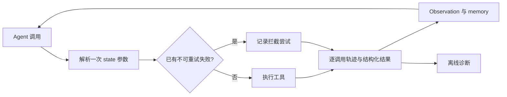

# ReliableToolAgent

[English](README.md) | **简体中文**

**工具调用 Agent 的运行时防护、有限响应恢复与可复算评估。**

Agent 能生成正确格式的工具调用，也可能没有完成任务。本项目让这些失败可以被检查：记录每次调用尝试，按实际执行目标判断重复失败，并区分 Agent 行为、Simulator 终止和评估器错误。

运行时基于 Hugging Face `smolagents` 扩展。另一条独立研究链使用 τ³ 官方 retail Agent 和 orchestrator；运行时 Guard 的实验在受控 toy 环境中完成。

[](https://github.com/Kk111777/ReliableToolAgent/actions/workflows/reliability-study.yml)
[](https://github.com/Kk111777/ReliableToolAgent/actions/workflows/tests.yml)
[](https://www.python.org/)

[工程设计](docs/engineering_v2.zh-CN.md) · [主实验结果](reports/frozen_study/retail-holdout-v1/README.zh-CN.md) · [复现说明](docs/reproduction.zh-CN.md) · [证据索引](reports/artifact_index.md)

## 项目实现了什么

| 模块 | 解决的问题 | 实现 |
|---|---|---|
| 工具调用记录 | 一个失败 step 可能混有多个成功、失败或被拦截的调用。 | 逐调用记录原始与解析后的参数、错误类型，分别统计尝试 / 执行 / 拦截。 |
| 感知 state 的失败 Guard | 同一个引用指向新订单后，可能继承旧目标的失败记录。 | 参数只解析一次，Guard、执行与失败历史使用同一目标。 |
| 有限响应恢复 | 空 User 响应和带围栏的 evaluator JSON 会中断运行。 | 空响应最多再生成一次，严格处理完整 JSON 围栏，格式最多重试两次，并记录每次请求费用。 |
| 参考动作诊断 | 已完成前几步时，终止指标可能漏掉最后一个 WRITE。 | 成功响应与参考动作按出现次数一一匹配，保留部分完成和未知值。 |
| 可复算实验记录 | 补跑、无效尝试和缺失配对可能改变结果分母。 | 固定任务选择，保留首次账本、来源哈希、任务级 bootstrap 和公开精简数据的离线检查。 |

WRITE 指会改变业务状态的工具操作，例如取消订单或提交退货。

## 快速开始

需要 `uv`、Python 3.12 和 `make`。安装脚本创建项目自己的 `.venv`；以下检查不需要模型凭据。

```bash
git clone https://github.com/Kk111777/ReliableToolAgent.git
cd ReliableToolAgent
bash setup-local.sh
make verify-project
```

`verify-project` 运行项目测试，检查文档链接，并核对主实验、案例、工程接通、测量修正和模型复核计数。它使用 `.venv/bin/python`，不调用模型。逐项命令和新克隆仓库的验证范围见[复现说明](docs/reproduction.zh-CN.md)。

<a id="system--experiment-architecture"></a>
<a id="architecture"></a>

## 运行流程



例如，`{"order_id":"lookup"}` 第一次解析到不存在的订单并失败；如果 `state["lookup"]` 后来指向有效订单，新调用可以执行。同一失败目标没有改变时，仍可以被拦截。[源码](src/smolagents/agents.py) · [回归测试](local_demo/test_duplicate_guard.py)。

响应适配器和参考动作分析器用于独立的 τ³ 工作流。新的原生接通检查没有部署 `smolagents` Guard。[接口与边界](docs/engineering_v2.zh-CN.md)。

<a id="key-findings"></a>

## 证据与结果

| 检查 | 保留结果 | 如何解读 |
|---|---|---|
| [冻结 retail 主实验](reports/frozen_study/retail-holdout-v1/README.zh-CN.md) | 35 个 test 任务 × 3 trial × U0/U2；**210 个首次尝试**，197 个有效评分；**93/105 有效配对（88.57%）**。 | 固定队列已完成，配对覆盖低于预设的 90% 门槛；独立的 20 题 train 计划没有启动。 |
| [评估器响应回放](reports/engineering-v2/evaluator_replay.json) | **6/6** 保留的围栏响应通过严格校验，payload 值保持不变。 | 支持格式处理修补；没有重新评分旧尝试。 |
| [新原生接通检查](reports/engineering-v2/README.zh-CN.md) | **4/4 有效尝试**，67 次 HTTP 请求。 | 核对连接、执行与费用记录；没有触发恢复分支，不能据此测定故障率下降。 |
| [测量 v2](reports/engineering-v2/measurement.json) | 197 条有效轨迹中，终止时遗漏 WRITE 候选 **48 → 61**；新增 13 条均为部分完成。 | 修正诊断覆盖，不代表 Agent 成功率提高。 |
| [另一会话模型复核](reports/model-review-v1/README.zh-CN.md) | 20 个选定片段；首次标签 **117/120** 一致，3 处参考缺失计数存在 `0` 与 `null` 分歧。 | 暴露了填写说明的一处歧义；保留首次判断，原协议继续使用 `null`。这是标签一致程度，不是准确率。 |

U0、U2 是固定 Agent 下的两种 User Simulator 配置。有效成功分别为 **48/94** 和 **93/103**。三对 trial 均有效的 25 个任务中，U2−U0 的任务级 reward 差为 **0.36 [0.24, 0.48]**。两组缺失情况不同，这个完整任务子集上的诊断衡量 Simulator 敏感性，不能证明 Agent 提升。

历史受控实验也完整保留：启用 retry framing 时，单靠结构化错误反馈使重复失败 **29 → 50**；三个任务的 toy Guard smoke 中，重复的实际执行失败 **6 → 0**。设置、评分版本和历史原生审计见[技术报告](reports/final_technical_report.md)。

## 一个值得查看的失败案例

[案例 C03](reports/frozen_study/retail-holdout-v1/cases.zh-CN.md)在最后一条 User 终止消息前，完成了三个参考 WRITE 中的两个。旧指标只识别“任何参考 WRITE 都没成功就终止”；测量 v2 还能标记剩下的动作。因此，工具执行、任务完成和指标覆盖需要分别记录。

[八个案例记录](reports/frozen_study/retail-holdout-v1/case_index.json)保留来源哈希、消息位置和工具计数，由分析器作者有目的选择。另一会话的模型复核增加了对选定片段的一次检查，并披露自动项目背景；它不是严格独立盲审或人工标注。

## 当前范围

工程修补、固定主实验、公开离线检查和双语报告已完成。train 扩展按预设配对门槛停止，没有继续开展原生控制器实验。

- Guard 有受控机制与接口证据，没有测得原生 τ³ Guard 收益。
- 响应恢复有故障合同与真实保留响应回放证据；四条新运行只说明接通。
- 精确参考匹配用于诊断。相同业务结果可能由不同参数实现，未知工具结果也不证明业务状态未改变。
- 公开文件支持重算汇总和工具计数；完整轨迹语义与官方 reward 复核需要保留的本地原始数据。

## 仓库导航

```text
src/smolagents/   调用轨迹、结构化错误与失败 Guard
local_demo/      确定性故障场景与项目测试
benchmark/tau3/  原生实验运行器、响应适配器与离线分析器
reports/         精简证据、结果、案例与模型复核记录
scripts/         公开证据与文档检查
docs/            工程接口与复现说明
```

本 fork 基于 Hugging Face `smolagents` commit `30bb1161095dbae2271e6bc3cc4c219cc3897a57`。框架示例及 `docs/source/` 继承自上游，保留上游归属与 [Apache 2.0 许可证](LICENSE)。
