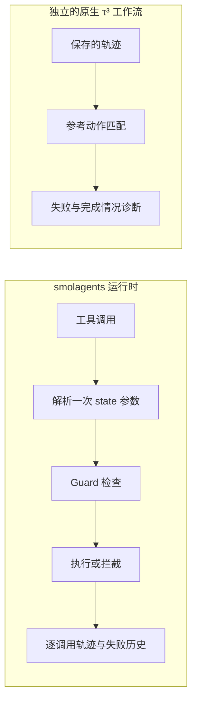

# ReliableToolAgent

[English](README.md) | **简体中文**

**工具调用 LLM Agent 的运行时防护与失败分析。**

我扩展了 `smolagents` 工具执行运行时，构建 τ³ retail 轨迹分析器，用受控实验研究重复失败与任务未完成。

[](https://github.com/Kk111777/ReliableToolAgent/actions/workflows/reliability-study.yml)
[](https://github.com/Kk111777/ReliableToolAgent/actions/workflows/tests.yml)

## 我的贡献

- **Agent 运行时**：逐调用记录、结构化错误与 state 感知 Guard；按实际执行目标判断重复，区分尝试、执行和拦截。[运行时源码](src/smolagents/agents.py) · [回归测试](local_demo/test_duplicate_guard.py)
- **轨迹分析**：READ/WRITE、重复与终止诊断；按出现次数匹配参考动作，保留部分完成。[分析器源码](benchmark/tau3/scripts/measurement_v2.py)
- **受控实验**：结构化错误 × 重试引导消融、Guard 机制检查和固定 Agent 的 Simulator 对照。[实验记录](reports/final_technical_report.md)

主要改动位于 `src/smolagents/{agents,memory,utils}.py`、`local_demo/`、`benchmark/tau3/` 及项目专用 `scripts/`；框架示例与 `docs/source/` 继承自上游。

<a id="key-findings"></a>

## 主要结果

| 贡献 | 证据 | 发现 |
|---|---|---|
| 重复失败 Guard | 三个任务的 toy smoke 中，重复的实际执行失败 **6 → 0** | 拦截不可重试失败；别名回归另验证目标改变后可调用。 |
| 部分完成分析 | 197 条有效 retail 轨迹中发现 **13 个旧指标漏掉的案例** | 识别“前面的 WRITE 已成功，但任务未完成”。 |
| Simulator 对照 | 固定 Agent，U0/U2 有效成功分别为 **48/94**、**93/103** | 只改变 User Simulator，也会明显改变测得的任务结果。 |

<a id="system--experiment-architecture"></a>
<a id="architecture"></a>

## 系统结构



## 工程案例：同一个引用，两个执行目标

`{"order_id":"lookup"}` 第一次解析到不存在的订单并失败。之后，`state["lookup"]` 指向有效订单。如果按原始参数生成失败键，第二次合法调用也会被拦截。

实现中只解析一次参数，Guard、实际执行和失败历史共用同一目标。目标改变后允许执行；目标未变且已有不可重试失败时可以拦截。[设计与接口边界](docs/engineering_v2.zh-CN.md#guard按执行目标判断重复)

## 基准发现：Simulator 会影响结果

Retail 研究固定 Agent，执行 **35 个 test 任务 × 3 trial × U0/U2**。在三对 trial 均有效的 25 个任务上，U2−U0 的平均 reward 差为 **+0.36**，95% 任务级 bootstrap 区间为 **[0.24, 0.48]**。两组缺失情况不同；配对覆盖为 93/105（88.57%），低于预设 90% 门槛，因此没有启动 train 扩展。这个结果说明 Simulator 敏感性，不代表 Agent 提升。[完整研究](reports/frozen_study/retail-holdout-v1/README.zh-CN.md)

## 快速开始

需要 `uv`、Python 3.12 和 `make`。以下命令创建项目自己的环境，运行离线检查，不需要模型凭据。

```bash
git clone https://github.com/Kk111777/ReliableToolAgent.git
cd ReliableToolAgent
bash setup-local.sh
make verify-project
```

## 深入阅读

- [工程设计](docs/engineering_v2.zh-CN.md)：运行时接口、响应适配与完成情况分析。
- [实验与发现](reports/frozen_study/retail-holdout-v1/README.zh-CN.md)：固定 Agent 对照与结果边界。
- [技术附录](docs/technical_appendix.zh-CN.md)：复现、来源证据、历史实验、复核与运行记录。

## 范围

- Guard 有 toy 机制证据，没有部署到原生 τ³。
- 参考匹配用于诊断，不能替代官方任务评分。
- 响应恢复通过故障合同与真实保留响应回放检查；四条新接通运行未触发恢复分支。

基于 Hugging Face `smolagents` commit `30bb1161095dbae2271e6bc3cc4c219cc3897a57`，保留上游归属与 [Apache 2.0 许可证](LICENSE)。
