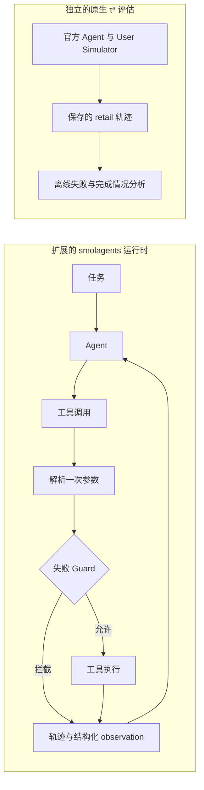

# ReliableToolAgent

[English](README.md) | **简体中文**

**基于 Hugging Face `smolagents` 的可靠性扩展，用于研究工具执行失败与 Agent 评估。**

ReliableToolAgent 为 Agent 运行时增加逐调用记录、结构化错误和感知 state 的失败 Guard。另一条独立的 τ³ retail 分析链检查工具失败、重复调用、任务部分完成，以及 Simulator 或评估器导致的中断。

项目从受控任务中的重复工具失败出发。迁移到原生 retail 后，已检查的运行没有提供足够依据来新增失败控制器；改变 User Simulator 却明显改变了测得的结果。因此，项目逐渐转向运行时防护、轨迹分析和受控评估。

[](https://github.com/Kk111777/ReliableToolAgent/actions/workflows/reliability-study.yml)
[](https://github.com/Kk111777/ReliableToolAgent/actions/workflows/tests.yml)

## 与 smolagents 有什么不同？

以下对照基于本 fork 使用的[固定上游版本](https://github.com/huggingface/smolagents/tree/30bb1161095dbae2271e6bc3cc4c219cc3897a57)。

| 上游基线 | 本项目的扩展 |
|---|---|
| 在 step 历史中保存工具调用与 observation | 逐调用结果，区分尝试 / 执行 / 拦截 |
| 工具调用与执行异常 | 结构化错误类型、可重试信息与失败历史 |
| 执行工具时替换 state 引用 | Guard 检查、执行和失败记录共用一次解析后的参数快照 |
| 没有 `duplicate_guard` 选项 | 可选的 Guard，拦截已知不可重试失败的精确重复调用 |

框架示例与 `docs/source/` 保留上游归属；运行时扩展与 retail 评估工具见下文。

## 核心模块

**可靠工具运行时。** 每次调用记录原始参数、解析后的目标、结果和错误。Guard 可以拦截已失败的目标，同时允许同一个 state 引用指向新目标。[运行时源码](src/smolagents/agents.py) · [回归测试](local_demo/test_duplicate_guard.py)

**轨迹失败分析。** 离线分析链区分 READ/WRITE，统计重复与失败事件，并把成功调用匹配到逐个参考动作。部分完成与参考信息缺失都会保留在分析中。[分析器](benchmark/tau3/scripts/measurement_v2.py)

**受控 Agent 评估。** 实验框架覆盖结构化错误 × 重试引导消融、toy Guard 检查和原生 τ³ 中固定 Agent 的 User Simulator 对照。响应适配器与执行护栏为这些实验提供支持。[实验说明](docs/experiments.zh-CN.md)

<a id="key-findings"></a>

## 结果

| 发现 | 结果 |
|---|---|
| 精确重复失败 Guard | 三个任务的受控 toy smoke 中，重复的实际执行失败 **6 → 0** |
| 部分完成分析 | 在 197 条有效 retail 运行中，识别出 **13 条旧指标遗漏的部分完成轨迹** |
| 固定 Agent 的 Simulator 研究 | U2−U0 平均 reward 差 **+0.36**，95% 任务级 bootstrap 区间 **[0.24, 0.48]** |

Simulator 估计使用三对 trial 均有效的 25 个任务。两组缺失情况不同，配对覆盖限制了后续扩展；该比较用于衡量固定 Agent 下的评估敏感性。[研究与边界](reports/frozen_study/retail-holdout-v1/README.zh-CN.md)

<a id="system--experiment-architecture"></a>
<a id="architecture"></a>

## 系统结构



## 一个工程案例

两次调用的原始参数相同，执行目标却可能不同：

```text
{"order_id": "lookup"}
第一次：state["lookup"] → 不存在的订单 → 不可重试失败
之后：  state["lookup"] → 有效订单     → 允许执行
```

只匹配原始参数会误拦截第二次调用。参数只解析一次，让 Guard、实际执行与失败历史保持一致。[接口设计](docs/engineering_v2.zh-CN.md#guard按执行目标判断重复)

## 快速开始

需要 `uv`、Python 3.12 和 `make`。安装脚本创建仓库自己的 `.venv`，检查离线运行，不需要模型凭据。

```bash
git clone https://github.com/Kk111777/ReliableToolAgent.git
cd ReliableToolAgent
bash setup-local.sh
make verify-project
```

原生 benchmark 运行与证据检查见[复现说明](docs/reproduction.zh-CN.md)。

## 项目结构

项目扩展主要位于以下文件与目录：

```text
src/smolagents/{agents,memory,utils}.py  运行时扩展
local_demo/                            受控任务与回归测试
benchmark/tau3/                        原生实验与轨迹分析
scripts/                               公开证据与文档检查
```

## 深入阅读

- [工程设计](docs/engineering_v2.zh-CN.md)：运行时接口、Guard 行为与参考匹配。
- [实验与发现](docs/experiments.zh-CN.md)：toy 消融、原生 retail 评估与 Simulator 敏感性。
- [复现与证据](docs/reproduction.zh-CN.md)：环境与命令；完整记录、复核和运行细节见[技术附录](docs/technical_appendix.zh-CN.md)。

## 范围

Guard 的验证来自受控 toy 任务，原生 τ³ 使用官方 Agent。参考匹配配合官方评分诊断完成情况。固定 retail 队列与工程修补已完成，train 扩展按预设覆盖门槛保持未启动。

基于 Hugging Face `smolagents`，保留 [Apache 2.0 许可证](LICENSE)。
