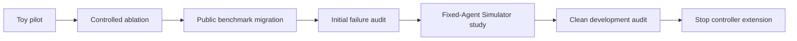

# ReliableToolAgent: Final Technical Report

The project combines runtime changes, controlled toy experiments, and a separate τ³ retail study. This report records the experiment design and full results behind the [project overview](../README.md).

Read [Sections 4–5](#4-structured-error--retry-framing-ablation) for the toy studies, [Sections 9–10](#9-user-simulator-confound) for the Simulator diagnostic and public audit, and [Section 13](#13-limitations) for limitations. Setup and data requirements are in the [reproduction guide](../docs/reproduction.md).

## 1. Motivation

Tool-calling agents can produce a correct final answer while still making redundant calls, mishandling tool failures, or ending at an ambiguous point in a multi-turn workflow. ReliableToolAgent was built to make those behaviors observable and attributable before introducing a recovery mechanism.

The project therefore separates three questions:

1. Did the tool/runtime execute the requested operation?
2. What did the Agent and User Simulator actually do?
3. Did the benchmark evaluator judge the business state and communication as correct?

## 2. Research Question

The initial research question was whether raw or structured tool-error feedback, retry framing, and a narrowly scoped duplicate-failure guard could make tool-calling behavior more reliable.

The public study then asked:

> Can the same observability and attribution pipeline be validated on a public multi-turn benchmark without changing the official Agent loop?

The final public-benchmark evidence is diagnostic. It is not a leaderboard claim and does not establish a general improvement from any intervention.



## 3. Controlled Pilot

Phase A used a small deterministic order/inventory environment with a scripted/fake model before real API calls. The harness covered:

- clean multi-step lookup;
- temporary failure followed by recovery;
- wrong entity followed by repair;
- legitimate order-not-found handling;
- repeated identical failure.

The harness established the end-to-end path:

```text
task → scripted model → tool call → tool execution → fault/observation
     → memory/trajectory → evaluator → metrics/artifact
```

This environment was useful for testing instrumentation and evaluator semantics. It was intentionally not treated as evidence of general LLM reliability.

## 4. Structured Error / Retry Framing Ablation

The fixed-model Qwen3.5 Flash ablation used four conditions, 24 runs per condition, for 96 runs total:

| Condition | Error representation | Retry framing |
|---|---|---|
| E0 | raw | enabled |
| E1 | structured | enabled |
| E2 | raw | disabled |
| E3 | structured | disabled |

Model configuration in the recorded artifact was temperature `0`, max tokens `512`, reasoning effort `none`, client timeout `60s`, and client retries `0`.

The original artifact-level results were mixed rather than uniformly positive across the 24 runs in each condition:

| Condition | Task success | Timely stop | Post-terminal unnecessary-call rate |
|---|---:|---:|---:|
| E0 raw + retry | 1.0000 | 0.1667 | 1.3333 |
| E1 structured + retry | 1.0000 | 0.0417 | 2.2083 |
| E2 raw, no retry | 0.9583 | 0.2083 | 1.5000 |
| E3 structured, no retry | 1.0000 | 0.1250 | 1.6667 |

Execution counts for the same runs:

| Condition | Terminal violations | Duplicate failed calls | Avg. tool calls | Avg. model calls |
|---|---:|---:|---:|---:|
| E0 raw + retry | 32 | 29 | 2.3333 | 3.3333 |
| E1 structured + retry | 53 | 50 | 3.2083 | 4.2083 |
| E2 raw, no retry | 36 | 33 | 2.5000 | 3.5000 |
| E3 structured, no retry | 40 | 40 | 2.6667 | 3.6667 |

Scoring-version note: the table preserves original recorded metrics. The existing [`evaluator-v2-ablation-summary.json`](evaluator-v2-ablation-summary.json) reports E2 success as `1.0000` (24/24) instead of `0.9583` (23/24). Only P04/r01 changes its success label: v2 accepts the already-produced Chinese missing-order wording “无法找到”. The answer and trajectory did not change. The [packaging audit](packaging_audit_20261003.md) records the comparison; neither existing result file was rewritten.

In this four-condition study, structured feedback had more duplicate failed calls than raw feedback under both retry settings: 29→50 with retry ON and 33→40 with retry OFF. Its additional average tool-call burden was larger with retry ON (0.8750) than OFF (0.1667). This is a descriptive adverse interaction, without a significance claim. The separate earlier 48-pair raw/structured pilot in `artifacts/comparison/` reported a small average reduction in duplicate-failed calls; it is historical evidence from a different experiment and must not be substituted for the 2×2 results. Neither study supports a consistent general benefit from metadata or retry framing.

## 5. Runtime Duplicate Guard

Duplicate Failure Guard V1 was implemented and tested as an isolated runtime experiment in the toy environment. Its exact key used the tool name and canonicalized arguments for the repeated-call check; retryable failures were not blocked, and each Agent run cleared its failure records.

The recorded Guard artifact is a smoke experiment on P03, P04, and P05, one repeat, with three runs per condition:

| Condition | Runs | Executed tool calls | Blocked calls | Duplicate executed failures |
|---|---:|---:|---:|---:|
| G0, no guard | 3 | 9 | 0 | 6 |
| G1, duplicate guard | 3 | 3 | 3 | 0 |

Both conditions had task success `1.0` on this small smoke set. The Guard therefore demonstrated instrumentation and blocking semantics in the toy fixture, but this artifact is not a public-benchmark result and is too small to support a general reliability or cost claim.

| Additional toy metric | Guard OFF | Guard ON |
|---|---:|---:|
| Task success | 3/3 | 3/3 |
| Terminal violations | 6 | 3 |
| Unnecessary attempts | 6 | 3 |

A blocked call is an Agent attempt that did not execute the tool. The Guard smoke retained three such attempts, so zero duplicate executed failures does not mean the model stopped proposing duplicates. Retryable failures and different arguments remain allowed. The Guard neither selects the next tool nor produces a final answer.

For example, P03 queries a missing order. Once the non-retryable failure is recorded, the same tool and normalized arguments produce a blocked observation instead of another tool execution. This checks the runtime mechanism; it does not demonstrate an improvement in Agent policy. Failure history is cleared between runs and does not provide in-flight deduplication or universal idempotence.

## 6. Why the Toy Environment Was Insufficient

The toy environment provided deterministic control but lacked several properties that matter in τ³:

- a realistic User Simulator with its own model behavior;
- multi-turn confirmation, transfer, and policy interactions;
- broader tool and business-state transitions;
- benchmark-specific DB and communication evaluators;
- realistic opportunities for a user-side terminal signal to end the simulation.

The toy experiments were therefore retained as controlled engineering evidence. They were not used to claim that the Guard or structured errors improve τ³ performance.

## 7. Migration to τ³ Retail

The public benchmark migration was pinned to:

```text
Repository: sierra-research/tau2-bench
Commit: b7ea9074c1cba482b30687fecdb5c8425fd6f619
Domain: retail
Task split: base
```

The official τ³ execution path was preserved:

```text
task → official Agent → official tool/environment → User Simulator
     → official evaluator/reward
```

The project did not insert the smolagents execution loop into τ³ and did not modify the official Agent, tools, tasks, environment, orchestrator, or reward logic.

## 8. Observability Pipeline

The offline analyzer reads official serialized trajectories and records:

- model-call and user-simulator-call counts;
- tool calls and tool effect class (`read`, `write`, or `generic`);
- explicit tool errors;
- exact same-message duplicates;
- exact cross-turn repeats;
- whether a repeat occurred after an intervening WRITE;
- mechanical tool-failure recovery signals;
- final reward and DB/NL components;
- terminal signal and post-confirmation completion fields.

Arguments are normalized with canonical JSON: dictionary keys are sorted, list order is preserved, and no fuzzy or semantic matching is applied.

The analyzer is deliberately descriptive. It does not label a repeated call as unnecessary and does not infer hidden model reasoning.

### Metric definitions

| Metric | Definition |
|---|---|
| Toy timely stop | Fraction of runs with no recorded terminal violation; successful task handling and unnecessary attempts are measured separately. |
| Expected WRITE observed | At least one successful WRITE matches an expected action's tool name and canonical arguments from official reward metadata. It is an offline check, not a substitute for final/DB reward. |
| Explicit tool failure | A parsed tool observation has error status; Simulator or evaluator termination is not a tool error. |
| Exact repeat | Same tool and canonical arguments; dictionary keys are sorted, list order is retained, and no semantic matching is used. |
| Same-message duplicate calls | Counts all calls in a duplicate group. The clean audit's two calls are one pair, not two additional redundant calls beyond the first. |
| Valid public run | A simulation that is not infrastructure-invalid. T04 remains in attempted-run counts but is excluded from Agent-behavior rates. |

The [source audit](packaging_audit_20261003.md) connects these definitions to retained files and source hashes. Failed calls can be present only in `model_output_message.tool_calls`, so the toy evaluator also checks those attempted calls rather than relying solely on the completed step's tool list.

## 9. User Simulator Confound

The first user-simulator diagnostic compared two accessible development conditions while holding the Agent fixed at `openai/qwen3.5-flash-2026-02-23`:

| Condition | User Simulator | Premature termination | Expected WRITE | DB success |
|---|---|---:|---:|---:|
| U0 | `openai/qwen3.5-flash-2026-02-23` | 8/15 | 5/15 | 5/15 |
| U2 | `openai/qwen3.8-max-2026-09-02` | 0/15 | 14/15 | 14/15 |

This was a development diagnostic comparison, not an official τ³ leaderboard comparison. It showed that User Simulator behavior could materially affect whether the Agent received another turn after confirmation. The project therefore froze U2 for the clean development audit rather than mixing U0 and U2 outcomes.

The final U0 denominator includes a same-configuration replacement for one initial infrastructure-invalid T04 trial 1. That parse failure remains documented in the stability analysis; 15/15 describes the final valid diagnostic set, not the absence of failed initial attempts. The comparison was not randomized and does not establish a universal Simulator ranking.

## 10. Clean Benchmark Results

The clean development audit used:

```text
Agent: openai/qwen3.5-flash-2026-02-23
User:  openai/qwen3.8-max-2026-09-02
temperature: 0
max_tokens: 512
LiteLLM timeout: 60s
LiteLLM num_retries: 3
simulation timeout: unset
max_steps: 200
runner max_retries: 0
concurrency: 1
seed: 300
```

The native Agent, environment, orchestrator, and reward rules were preserved. An external evaluator wrapper allowed up to two additional parse retries for malformed NL-evaluator output; this changes infrastructure handling rather than reward semantics. It does not make the full launch path identical to an unwrapped upstream run.

Results:

| Metric | Result |
|---|---:|
| Tasks attempted | 20 |
| Valid simulations | 19/20 |
| Normal `USER_STOP` among valid simulations | 19/19 |
| Simulation timeouts | 0 |
| Final reward = 1 | 18/19 |
| DB reward = 1 | 18/19 |
| NL reward = 1 | 19/19 |
| Tasks with expected WRITE | 17 |
| Successful expected WRITE | 16/17 |
| Cross-turn exact repeat | 0 |
| Same-message exact duplicate | 1 task, 2 calls |
| Explicit tool-failure tasks | 3 |

T04 ended with an evaluator JSON parse failure after the configured evaluator parse retries. It is infrastructure-invalid and is excluded from Agent behavior statistics. It is not counted as a reward-zero Agent task.

The three explicit tool-failure tasks were T10, T12, and T13. One case, T13, had a later same-tool call with different arguments that succeeded. All three ended normally with a valid reward under the analyzer's mechanical recovery definition.

## 11. Residual Failure Analysis

The only valid reward-zero case was T05:

- DB reward: `0`;
- NL reward: `1`;
- final terminal signal: `###TRANSFER###`;
- an earlier confirmed desk-lamp exchange WRITE succeeded;
- the official expected final WRITE was a water-bottle return;
- that expected return was not successfully executed;
- the User Simulator ended the simulation after the Agent explained the order-state restriction.

The expected return was missing and the Simulator ended the conversation. The trace does not isolate which component should have handled the changed request differently. The detailed reconstruction is in [`residual_case_T05.md`](residual_case_T05.md).

## 12. Negative Results / Abandoned Hypotheses

The findings did not justify another controller:

- Structured error feedback did not produce a consistent improvement in the controlled ablation.
- Generic retry framing did not produce a consistent improvement.
- The toy Duplicate Failure Guard reduced repeated execution in its small smoke experiment, but it was not migrated to τ³.
- The clean τ³ audit contained zero cross-turn exact repeats, so it does not provide evidence for migrating a cross-turn duplicate guard.
- The only valid reward-zero case is entangled with User Simulator termination and a changed user request.

The initial retry-loop hypothesis held in the toy tasks but did not describe the main failure pattern in the clean public subset. Controller work stopped at that point. This decision applies to the measured configuration; other tasks and Agents may have different failure patterns.

## 13. Limitations

- The toy environment is narrow and synthetic.
- The τ³ development configuration uses an accessible User Simulator rather than the official leaderboard default.
- The clean audit has one trial per task and 19 valid simulations.
- The task set is a fixed retail development set, not a full leaderboard submission.
- Cost values are unavailable for the Qwen snapshots because LiteLLM did not have a matching price-map entry; runner cost displays of `$0.0000` should not be read as zero real cost.
- The User Simulator diagnostic is not a randomized model comparison and should not be interpreted as a general model ranking.
- The residual attribution is observational; no causal intervention was run on τ³.
- Original E2 task success is 23/24 and the existing v2 rescore is 24/24; both versions use the same trajectory. Report the scoring version rather than treating the difference as an Agent gain.
- Raw model trajectories remain local. A public clone can check snapshots and deterministic tests, but cannot independently recompute all recorded experimental outcomes.
- The Guard acts on recorded failure history within one run. It does not guarantee concurrent-call deduplication, and failures dependent on changing environment state require separate invalidation semantics before wider use.

## 14. Conclusions

The runtime changes made tool attempts, execution results, and blocking behavior visible. Controlled tests showed that structured errors alone did not reliably improve stopping, while the narrow Guard prevented repeated execution in its toy smoke.

The native τ³ study exposed a different issue: changing the User Simulator changed measured outcomes under a fixed Agent. The clean audit then recorded 18/19 valid successes and no cross-turn exact repeats. Together, these results support the observability workflow and the decision to stop further retry-controller work for this subset.

## 15. Reproducibility

The [reproduction guide](../docs/reproduction.md) separates public-file checks, retained-raw checks, and paid benchmark execution. Configurations and source paths are listed in [`artifact_index.md`](artifact_index.md).

From the project environment, check the published files and retained local sources without making model calls:

```bash
.venv/bin/python scripts/audit_packaging_evidence.py
.venv/bin/python scripts/audit_packaging_evidence.py --local
```

The local check requires the retained raw files listed in the guide. For deterministic tests, follow the guide's public-file checks. For τ³ analysis or a new evaluation, use the commands in the [benchmark guide](../benchmark/tau3/README.md); its independent checkout remains pinned to commit `b7ea9074c1cba482b30687fecdb5c8425fd6f619`.
